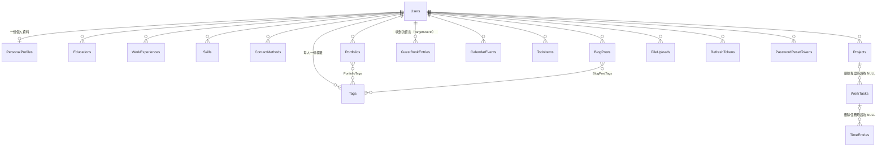

# 資料庫設計

模型以 EF Core 定義在 `backend/src/PersonalManager.Api/Models` 與 `Data/ApplicationDbContext.cs`，由 migration 建立資料表。
本文件說明資料表的用途與關係；欄位的最新定義以程式碼為準。

## 原則

- **資料庫**：預設 SQLite，可切換 MySQL／MariaDB；兩種資料庫各有一組 migration（`Migrations/Sqlite`、`Migrations/MySql`），模型相同（ADR-008）
- **時間**：`DateTime` 一律以 UTC 存取（`UtcDateTimeConverter`）；只有日期或時間的欄位使用 `DateOnly`／`TimeOnly`
- **Enum**：以字串儲存（例如 `"Published"`），新增選項不影響既有資料
- **擁有者**：屬於使用者的資料表都有 `UserId`（實作 `IOwnedByUser`），API 以 `OwnedBy(userId)` 限定範圍
- **排序**：可由使用者排序的資料表有 `SortOrder`（實作 `ISortable`）
- **索引**：全部以 `HasIndex` 定義，會出現在 migration 中

## 關係總覽

## 帳號與認證

| 資料表 | 用途 | 重點欄位 |
| --- | --- | --- |
| `Users` | 帳號 | `Username`（唯一，英數底線連字號）、`Email`（唯一）、`PasswordHash`（BCrypt）、`Role`（`User`／`Admin`）、`IsActive` |
| `RefreshTokens` | 登入工作階段 | `TokenHash`（SHA-256，唯一；不存原始 token）、`ExpiresAt`、`IsRevoked`。每次 refresh 輪換（ADR-010） |
| `PasswordResetTokens` | 重設密碼連結 | `TokenHash`（唯一）、`ExpiresAt`、`IsUsed` |

## 公開頁面內容

| 資料表 | 用途 | 重點欄位 |
| --- | --- | --- |
| `PersonalProfiles` | 個人介紹與公開頁面呈現設定（每人一份，`UserId` 唯一） | `Title`、`Summary`、`ProfileImageUrl`、`ThemeColor`、`AvailabilityStatus`；呈現設定 `PortfolioMode`、`CardStyle`、`CardRatio`、`SkillDisplay`（ADR-012） |
| `Educations` | 學歷 | `School`、`Degree`、`FieldOfStudy`、`StartYear`／`EndYear`、`IsPublic`、`SortOrder` |
| `WorkExperiences` | 工作經歷 | `Company`、`Position`、`StartDate`／`EndDate`（`DateOnly`）、`IsCurrent`、`IsPublic`、`SortOrder` |
| `Skills` | 技能 | `Name`、`Category`（自由輸入）、`Level`（選填）、`YearsOfExperience`（選填）、`IsPublic`、`SortOrder` |
| `ContactMethods` | 聯絡方式 | `Type`（Email、Phone、GitHub、Behance…）、`Label`、`Value`、`IsPublic`、`SortOrder` |
| `Portfolios` | 作品 | 見下方 |
| `BlogPosts` | 文章 | `Slug`（每位使用者範圍內唯一）、`Content`（已清洗的 HTML）、`Status`、`PublishedAt`（未來時間即為排程）、`CoverImageUrl`、`ReadingMinutes`、`ViewCount` |
| `Tags` | 使用者自己的標籤，文章與作品共用 | `(UserId, Name)` 唯一 |
| `GuestBookEntries` | 留言板 | `TargetUserId`（留言給誰）、`Name`、`Email`（不公開）、`Message`、`IsApproved`、`AdminReply`、`RepliedAt` |

### Portfolios（作品）

一般欄位存放基本資訊，內容以 JSON 文字存在同一列（ADR-012），整份作品一起讀寫：

| 欄位 | 內容 |
| --- | --- |
| `Title`、`Slug`、`Summary`、`Category`、`Year` | 基本資訊；`(UserId, Slug)` 唯一 |
| `Role`、`Period` | 固定的作品資訊欄位 |
| `IsFeatured`、`IsPublic`、`SortOrder` | 顯示設定 |
| `CoverFocus` | 封面裁切時保留的位置（CSS `object-position`，例如 `50% 30%`） |
| `Covers`（JSON） | 封面圖片清單：網址、尺寸、說明、替代文字、`FileId` |
| `Fields`（JSON） | 自訂的作品資訊欄位（名稱／內容） |
| `Links`（JSON） | 連結 |
| `Blocks`（JSON） | 內容區塊，以 `type` 區分：`text`、`image`、`gallery`、`files`、`embed`、`metrics`、`code` |

JSON 欄位使用一般文字型別，SQLite 與 MySQL 都適用（`Data/JsonColumns.cs`）；缺點是無法在資料庫中查詢區塊內容。

## 個人工具

| 資料表 | 用途 | 重點欄位 |
| --- | --- | --- |
| `CalendarEvents` | 行事曆 | `StartTime`／`EndTime`（UTC）、`IsAllDay`、`IsPublic`、`Color`、`Recurrence`（每天／週／月／年）、`RecurrenceUntil`；重複行程由後端展開 |
| `TodoItems` | 待辦 | `Priority`、`Status`、`DueDate`、`CompletedAt` |
| `Projects` | 工作追蹤的專案 | `Name`、`Color`、`SortOrder` |
| `WorkTasks` | 工作任務 | `ProjectId`（選填）、`Priority`、`Status`、`EstimatedHours`；實際時數由時間紀錄加總，不另外儲存 |
| `TimeEntries` | 時間紀錄 | `WorkTaskId`（選填；沒有任務時以 `Title` 描述）、`Date`、`StartTime`／`EndTime`（選填）、`DurationMinutes` |

## 檔案

| 資料表 | 用途 | 重點欄位 |
| --- | --- | --- |
| `FileUploads` | 上傳的檔案 | `FileName`（原始檔名，只用於顯示）、`StoredName`（GUID）、`FileUrl`、`Kind`、`MimeType`（由伺服器依檔案內容判斷）、`FileSize`、`Width`／`Height`（圖片） |

作品與文章以網址或 `FileId` 引用檔案，沒有外鍵；刪除前由 `GET /api/me/files/{id}/usages` 找出使用中的內容並提示。

## 修改資料表

步驟見 [`development-guide.md`](development-guide.md#修改資料表)。
