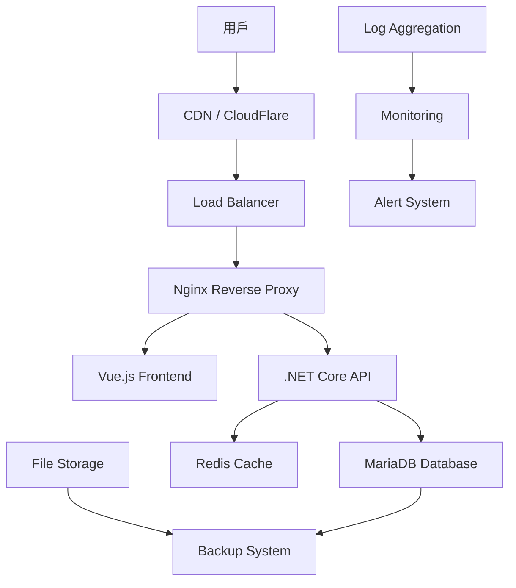

# Personal Manager 生產部署指南

## 🚀 生產部署清單

### 部署前檢查清單

#### ✅ 代碼品質檢查
- [ ] 所有單元測試通過
- [ ] 整合測試通過
- [ ] E2E 測試通過
- [ ] 代碼審查完成
- [ ] 安全性掃描通過
- [ ] 效能測試達標

#### ✅ 環境配置檢查
- [ ] 生產環境變數設定完成
- [ ] 資料庫遷移腳本準備就緒
- [ ] SSL 憑證配置完成
- [ ] CDN 設定完成
- [ ] 監控系統配置完成

#### ✅ 備份策略檢查
- [ ] 資料庫備份策略建立
- [ ] 檔案備份策略建立
- [ ] 回滾計劃準備完成
- [ ] 災難恢復計劃建立

### 🏗️ 基礎設施架構



### 🔧 環境配置

#### 生產環境變數設定

**後端環境變數 (appsettings.Production.json):**
```json
{
  "ConnectionStrings": {
    "DefaultConnection": "Server=${DB_HOST};Database=${DB_NAME};User=${DB_USER};Password=${DB_PASSWORD};SslMode=Required;"
  },
  "Logging": {
    "LogLevel": {
      "Default": "Warning",
      "Microsoft.AspNetCore": "Warning",
      "Microsoft.EntityFrameworkCore": "Warning"
    }
  },
  "JwtSettings": {
    "SecretKey": "${JWT_SECRET}",
    "Issuer": "PersonalManager",
    "Audience": "PersonalManagerUsers",
    "ExpirationHours": 24
  },
  "Cors": {
    "AllowedOrigins": ["https://your-domain.com"]
  },
  "FileUpload": {
    "MaxFileSize": 10485760,
    "AllowedExtensions": [".jpg", ".jpeg", ".png", ".gif", ".pdf", ".doc", ".docx"],
    "UploadPath": "/app/uploads"
  },
  "Email": {
    "SmtpHost": "${SMTP_HOST}",
    "SmtpPort": 587,
    "SmtpUser": "${SMTP_USER}",
    "SmtpPassword": "${SMTP_PASSWORD}",
    "FromEmail": "noreply@your-domain.com",
    "FromName": "Personal Manager"
  }
}
```

**前端環境變數 (.env.production):**
```env
# API 設定
VITE_API_BASE_URL=https://api.your-domain.com/api

# 應用程式設定
VITE_APP_TITLE=Personal Manager
VITE_APP_VERSION=1.0.0
VITE_APP_DESCRIPTION=Professional Personal Management Platform

# 第三方服務
VITE_GOOGLE_ANALYTICS_ID=G-XXXXXXXXXX
VITE_SENTRY_DSN=https://xxx@sentry.io/xxx

# 功能開關
VITE_ENABLE_PWA=true
VITE_ENABLE_GOOGLE_LOGIN=false
VITE_ENABLE_GITHUB_LOGIN=false

# 效能設定
VITE_ENABLE_SERVICE_WORKER=true
VITE_CACHE_VERSION=v1.0.0
```

### 🐳 容器化部署

#### 優化後的 Dockerfile

**後端 Dockerfile (生產最佳化):**
```dockerfile
# PersonalManagerBackend/Dockerfile.production
FROM mcr.microsoft.com/dotnet/aspnet:8.0-alpine AS base
WORKDIR /app
EXPOSE 8080

# 建立非 root 使用者
RUN addgroup -g 1001 -S appgroup && \
    adduser -S appuser -u 1001 -G appgroup

FROM mcr.microsoft.com/dotnet/sdk:8.0-alpine AS build
WORKDIR /src

# 複製專案檔案並還原相依性
COPY ["PersonalManagerAPI.csproj", "."]
RUN dotnet restore "PersonalManagerAPI.csproj"

# 複製原始碼並建置
COPY . .
RUN dotnet build "PersonalManagerAPI.csproj" -c Release -o /app/build

FROM build AS publish
RUN dotnet publish "PersonalManagerAPI.csproj" -c Release -o /app/publish \
    --no-restore --runtime linux-musl-x64 --self-contained false

FROM base AS final
WORKDIR /app

# 建立必要目錄
RUN mkdir -p /app/uploads /app/logs && \
    chown -R appuser:appgroup /app

# 複製發布檔案
COPY --from=publish /app/publish .
COPY --chown=appuser:appgroup --from=publish /app/publish .

# 切換到非 root 使用者
USER appuser

# 健康檢查
HEALTHCHECK --interval=30s --timeout=3s --start-period=5s --retries=3 \
    CMD curl -f http://localhost:8080/api/health || exit 1

ENTRYPOINT ["dotnet", "PersonalManagerAPI.dll"]
```

**前端 Dockerfile (生產最佳化):**
```dockerfile
# PersonalManagerFrontend/Dockerfile.production
FROM node:20-alpine AS build

# 設定工作目錄
WORKDIR /app

# 複製 package 檔案
COPY package*.json ./

# 安裝相依性 (只安裝生產相依性)
RUN npm ci --only=production --silent

# 複製原始碼
COPY . .

# 建置應用程式
RUN npm run build

# 生產階段
FROM nginx:1.25-alpine AS production

# 安裝 curl (健康檢查用)
RUN apk add --no-cache curl

# 建立非 root 使用者
RUN addgroup -g 1001 -S nginx && \
    adduser -S appuser -u 1001 -G nginx

# 複製建置檔案
COPY --from=build /app/dist /usr/share/nginx/html

# 複製 Nginx 設定
COPY nginx.production.conf /etc/nginx/conf.d/default.conf

# 設定權限
RUN chown -R appuser:nginx /usr/share/nginx/html && \
    chown -R appuser:nginx /var/cache/nginx && \
    chown -R appuser:nginx /var/log/nginx && \
    chown -R appuser:nginx /etc/nginx/conf.d

# 修改 Nginx 設定以使用非 root 使用者
RUN sed -i 's/listen 80/listen 8080/' /etc/nginx/conf.d/default.conf

USER appuser

EXPOSE 8080

# 健康檢查
HEALTHCHECK --interval=30s --timeout=3s --start-period=5s --retries=3 \
    CMD curl -f http://localhost:8080/health || exit 1

CMD ["nginx", "-g", "daemon off;"]
```

#### Nginx 生產配置
```nginx
# nginx.production.conf
server {
    listen 8080;
    server_name _;
    root /usr/share/nginx/html;
    index index.html;

    # Gzip 壓縮
    gzip on;
    gzip_vary on;
    gzip_min_length 1024;
    gzip_types text/plain text/css text/xml text/javascript 
               application/javascript application/xml+rss 
               application/json image/svg+xml;

    # 安全性標頭
    add_header X-Frame-Options "SAMEORIGIN" always;
    add_header X-XSS-Protection "1; mode=block" always;
    add_header X-Content-Type-Options "nosniff" always;
    add_header Referrer-Policy "no-referrer-when-downgrade" always;
    add_header Content-Security-Policy "default-src 'self' http: https: data: blob: 'unsafe-inline'" always;

    # 快取設定
    location ~* \.(js|css|png|jpg|jpeg|gif|ico|svg)$ {
        expires 1y;
        add_header Cache-Control "public, immutable";
    }

    # 處理 Vue Router 歷史模式
    location / {
        try_files $uri $uri/ /index.html;
    }

    # 健康檢查端點
    location /health {
        access_log off;
        return 200 "healthy\n";
        add_header Content-Type text/plain;
    }

    # API 代理 (如果需要)
    location /api/ {
        proxy_pass http://backend:8080/api/;
        proxy_set_header Host $host;
        proxy_set_header X-Real-IP $remote_addr;
        proxy_set_header X-Forwarded-For $proxy_add_x_forwarded_for;
        proxy_set_header X-Forwarded-Proto $scheme;
    }
}
```

### 🚀 Zeabur 部署配置

#### Zeabur 專案設定
```yaml
# zeabur.yaml
name: personal-manager
region: us-west-1

services:
  # 資料庫服務
  database:
    type: mariadb
    version: "10.6"
    plan: pro
    storage: 20GB
    variables:
      MYSQL_DATABASE: personal_manager
      MYSQL_USER: pm_user

  # 後端 API 服務
  backend:
    type: git
    source: https://github.com/hn83320589/PersonalManagerBackend
    branch: main
    buildCommand: dotnet publish -c Release -o /app/publish
    startCommand: dotnet PersonalManagerAPI.dll
    environment:
      ASPNETCORE_ENVIRONMENT: Production
      ConnectionStrings__DefaultConnection: mysql://${database.username}:${database.password}@${database.host}:${database.port}/${database.database}?sslmode=required
      JwtSettings__SecretKey: ${JWT_SECRET}
      Cors__AllowedOrigins: https://${frontend.domain}
    envVars:
      JWT_SECRET:
        type: secret
        value: your-super-secure-jwt-secret-key-here
    domains:
      - api.your-domain.com
    healthCheck:
      path: /api/health
      interval: 30s
    resources:
      cpu: 0.5
      memory: 1GB

  # 前端服務
  frontend:
    type: git
    source: https://github.com/hn83320589/PersonalManagerFrontend
    branch: main
    buildCommand: npm run build
    outputDir: dist
    environment:
      VITE_API_BASE_URL: https://${backend.domain}/api
      VITE_APP_VERSION: 1.0.0
    domains:
      - your-domain.com
      - www.your-domain.com
    cdn: true
    staticOptimization: true
    resources:
      cpu: 0.2
      memory: 512MB

  # Redis 快取 (可選)
  cache:
    type: redis
    version: "7.0"
    plan: basic
    evictionPolicy: allkeys-lru

# 環境變數
env:
  production:
    JWT_SECRET: ${JWT_SECRET}
    SMTP_HOST: ${SMTP_HOST}
    SMTP_USER: ${SMTP_USER}
    SMTP_PASSWORD: ${SMTP_PASSWORD}
    GOOGLE_ANALYTICS_ID: ${GOOGLE_ANALYTICS_ID}
    SENTRY_DSN: ${SENTRY_DSN}

# 網域設定
domains:
  - name: your-domain.com
    service: frontend
    ssl: auto
  - name: api.your-domain.com
    service: backend
    ssl: auto

# 監控設定
monitoring:
  enabled: true
  alerts:
    - type: uptime
      threshold: 99.9
    - type: response_time
      threshold: 500ms
    - type: error_rate
      threshold: 5%
```

### ⚙️ GitHub Actions CI/CD

#### 完整部署工作流程
```yaml
# .github/workflows/deploy-production.yml
name: Deploy to Production

on:
  push:
    branches: [main]
    tags: ['v*']
  workflow_dispatch:

env:
  NODE_VERSION: '20'
  DOTNET_VERSION: '8.0'

jobs:
  # 版本和變更檢測
  detect-changes:
    runs-on: ubuntu-latest
    outputs:
      backend-changed: ${{ steps.changes.outputs.backend }}
      frontend-changed: ${{ steps.changes.outputs.frontend }}
      version: ${{ steps.version.outputs.version }}
    steps:
      - uses: actions/checkout@v4
        with:
          fetch-depth: 0

      - uses: dorny/paths-filter@v2
        id: changes
        with:
          filters: |
            backend:
              - 'PersonalManagerBackend/**'
            frontend:
              - 'PersonalManagerFrontend/**'

      - name: Get version
        id: version
        run: |
          if [[ $GITHUB_REF == refs/tags/* ]]; then
            VERSION=${GITHUB_REF#refs/tags/}
          else
            VERSION=$(git rev-parse --short HEAD)
          fi
          echo "version=$VERSION" >> $GITHUB_OUTPUT

  # 後端測試和建置
  backend-test-build:
    needs: detect-changes
    if: needs.detect-changes.outputs.backend-changed == 'true'
    runs-on: ubuntu-latest
    
    services:
      mysql:
        image: mariadb:10.6
        env:
          MYSQL_ROOT_PASSWORD: rootpassword
          MYSQL_DATABASE: personal_manager_test
        options: >-
          --health-cmd="mysqladmin ping"
          --health-interval=10s
          --health-timeout=5s
          --health-retries=3
        ports:
          - 3306:3306

    steps:
      - uses: actions/checkout@v4

      - name: Setup .NET
        uses: actions/setup-dotnet@v4
        with:
          dotnet-version: ${{ env.DOTNET_VERSION }}

      - name: Cache dependencies
        uses: actions/cache@v3
        with:
          path: ~/.nuget/packages
          key: ${{ runner.os }}-nuget-${{ hashFiles('**/packages.lock.json') }}

      - name: Restore dependencies
        run: dotnet restore
        working-directory: PersonalManagerBackend

      - name: Build
        run: dotnet build --no-restore --configuration Release
        working-directory: PersonalManagerBackend

      - name: Test
        run: dotnet test --no-build --configuration Release --logger trx --collect:"XPlat Code Coverage"
        working-directory: PersonalManagerBackend
        env:
          ConnectionStrings__DefaultConnection: "Server=localhost;Database=personal_manager_test;User=root;Password=rootpassword;"

      - name: Publish test results
        uses: dorny/test-reporter@v1
        if: success() || failure()
        with:
          name: Backend Tests
          path: 'PersonalManagerBackend/**/*.trx'
          reporter: dotnet-trx

      - name: Security scan
        uses: securecodewarrior/github-action-add-sarif@v1
        with:
          sarif-file: 'security-scan-results.sarif'

  # 前端測試和建置
  frontend-test-build:
    needs: detect-changes
    if: needs.detect-changes.outputs.frontend-changed == 'true'
    runs-on: ubuntu-latest

    steps:
      - uses: actions/checkout@v4

      - name: Setup Node.js
        uses: actions/setup-node@v4
        with:
          node-version: ${{ env.NODE_VERSION }}
          cache: 'npm'
          cache-dependency-path: PersonalManagerFrontend/package-lock.json

      - name: Install dependencies
        run: npm ci
        working-directory: PersonalManagerFrontend

      - name: Type check
        run: npm run type-check
        working-directory: PersonalManagerFrontend

      - name: Lint
        run: npm run lint
        working-directory: PersonalManagerFrontend

      - name: Unit tests
        run: npm run test:unit -- --coverage
        working-directory: PersonalManagerFrontend

      - name: Upload coverage to Codecov
        uses: codecov/codecov-action@v3
        with:
          directory: PersonalManagerFrontend/coverage

      - name: E2E tests
        run: npm run test:e2e
        working-directory: PersonalManagerFrontend

      - name: Build for production
        run: npm run build
        working-directory: PersonalManagerFrontend
        env:
          VITE_API_BASE_URL: https://api.your-domain.com/api
          VITE_APP_VERSION: ${{ needs.detect-changes.outputs.version }}

      - name: Bundle analyzer
        run: npm run analyze
        working-directory: PersonalManagerFrontend

  # 安全性掃描
  security-scan:
    runs-on: ubuntu-latest
    steps:
      - uses: actions/checkout@v4

      - name: Run Trivy vulnerability scanner
        uses: aquasecurity/trivy-action@master
        with:
          scan-type: 'fs'
          scan-ref: '.'
          format: 'sarif'
          output: 'trivy-results.sarif'

      - name: Upload Trivy scan results to GitHub Security tab
        uses: github/codeql-action/upload-sarif@v2
        with:
          sarif_file: 'trivy-results.sarif'

  # 部署到 Zeabur
  deploy-zeabur:
    needs: [detect-changes, backend-test-build, frontend-test-build]
    if: always() && (needs.backend-test-build.result == 'success' || needs.backend-test-build.result == 'skipped') && (needs.frontend-test-build.result == 'success' || needs.frontend-test-build.result == 'skipped')
    runs-on: ubuntu-latest
    environment: production

    steps:
      - uses: actions/checkout@v4

      - name: Deploy to Zeabur
        uses: zeabur/deploy-action@v1
        with:
          zeabur-token: ${{ secrets.ZEABUR_TOKEN }}
          environment: production

      - name: Wait for deployment
        run: |
          echo "Waiting for deployment to complete..."
          sleep 60

      - name: Health check
        run: |
          curl -f https://api.your-domain.com/api/health
          curl -f https://your-domain.com/health

      - name: Notify deployment success
        uses: 8398a7/action-slack@v3
        with:
          status: success
          text: '✅ Production deployment successful!'
        env:
          SLACK_WEBHOOK_URL: ${{ secrets.SLACK_WEBHOOK_URL }}

  # 部署後測試
  post-deployment-tests:
    needs: deploy-zeabur
    runs-on: ubuntu-latest
    steps:
      - uses: actions/checkout@v4

      - name: Setup Node.js
        uses: actions/setup-node@v4
        with:
          node-version: ${{ env.NODE_VERSION }}

      - name: Install dependencies
        run: npm ci
        working-directory: PersonalManagerFrontend

      - name: Run production E2E tests
        run: npm run test:e2e:production
        working-directory: PersonalManagerFrontend
        env:
          BASE_URL: https://your-domain.com

      - name: Performance testing
        run: |
          npx lighthouse https://your-domain.com --output json --output-path lighthouse-report.json
          npx lighthouse https://your-domain.com --output html --output-path lighthouse-report.html

      - name: Upload performance report
        uses: actions/upload-artifact@v3
        with:
          name: lighthouse-report
          path: lighthouse-report.*

  # 回滾計劃 (如果測試失敗)
  rollback:
    needs: [deploy-zeabur, post-deployment-tests]
    if: failure()
    runs-on: ubuntu-latest
    environment: production

    steps:
      - name: Rollback deployment
        uses: zeabur/rollback-action@v1
        with:
          zeabur-token: ${{ secrets.ZEABUR_TOKEN }}
          environment: production

      - name: Notify rollback
        uses: 8398a7/action-slack@v3
        with:
          status: failure
          text: '⚠️ Deployment failed, rolled back to previous version'
        env:
          SLACK_WEBHOOK_URL: ${{ secrets.SLACK_WEBHOOK_URL }}
```

### 📊 監控和警報

#### Application Insights 設定
```csharp
// Program.cs
builder.Services.AddApplicationInsightsTelemetry(options =>
{
    options.ConnectionString = builder.Configuration.GetConnectionString("ApplicationInsights");
});

// 自訂遙測
builder.Services.AddSingleton<ITelemetryInitializer, CustomTelemetryInitializer>();
```

#### 前端監控設定
```typescript
// monitoring/index.ts
import { Application } from '@microsoft/applicationinsights-web'

const appInsights = new Application({
  config: {
    connectionString: import.meta.env.VITE_APPLICATION_INSIGHTS_CONNECTION_STRING,
    enableAutoRouteTracking: true,
    enableCorsCorrelation: true
  }
})

appInsights.loadAppInsights()

export { appInsights }
```

#### 健康檢查端點
```csharp
// HealthChecks.cs
public class DatabaseHealthCheck : IHealthCheck
{
    private readonly ApplicationDbContext _context;

    public async Task<HealthCheckResult> CheckHealthAsync(
        HealthCheckContext context, 
        CancellationToken cancellationToken = default)
    {
        try
        {
            await _context.Database.CanConnectAsync(cancellationToken);
            return HealthCheckResult.Healthy("Database connection successful");
        }
        catch (Exception ex)
        {
            return HealthCheckResult.Unhealthy("Database connection failed", ex);
        }
    }
}

// Program.cs
builder.Services.AddHealthChecks()
    .AddCheck<DatabaseHealthCheck>("database")
    .AddCheck("api", () => HealthCheckResult.Healthy("API is responding"));
```

### 🔒 安全性最佳實踐

#### HTTPS 和 SSL 設定
```nginx
# SSL 配置
server {
    listen 443 ssl http2;
    server_name your-domain.com;

    # SSL 憑證
    ssl_certificate /etc/ssl/certs/your-domain.crt;
    ssl_certificate_key /etc/ssl/private/your-domain.key;

    # SSL 設定
    ssl_protocols TLSv1.2 TLSv1.3;
    ssl_ciphers ECDHE-RSA-AES128-GCM-SHA256:ECDHE-RSA-AES256-GCM-SHA384;
    ssl_prefer_server_ciphers off;

    # HSTS
    add_header Strict-Transport-Security "max-age=63072000" always;

    # 其他安全性標頭
    add_header X-Frame-Options DENY always;
    add_header X-Content-Type-Options nosniff always;
    add_header X-XSS-Protection "1; mode=block" always;
}

# HTTP 重導向到 HTTPS
server {
    listen 80;
    server_name your-domain.com;
    return 301 https://$server_name$request_uri;
}
```

#### 環境變數安全管理
```bash
# 使用 Zeabur Secrets 管理敏感資訊
zeabur env set JWT_SECRET="your-super-secure-secret"
zeabur env set DB_PASSWORD="your-database-password"
zeabur env set SMTP_PASSWORD="your-smtp-password"

# 本地開發使用 .env.local (不提交到版控)
echo ".env.local" >> .gitignore
```

### 📈 效能最佳化

#### CDN 設定
```javascript
// CDN 設定範例 (CloudFlare)
const cdnConfig = {
  zones: [
    {
      name: "your-domain.com",
      settings: {
        caching_level: "aggressive",
        browser_cache_ttl: 31536000, // 1 年
        development_mode: false,
        minify: {
          css: true,
          js: true,
          html: true
        }
      }
    }
  ],
  page_rules: [
    {
      targets: [{ target: "url", constraint: { operator: "matches", value: "*.your-domain.com/api/*" }}],
      actions: [{ id: "cache_level", value: "bypass" }]
    }
  ]
}
```

#### 資料庫最佳化
```sql
-- 建立必要索引
CREATE INDEX idx_users_username ON Users(Username);
CREATE INDEX idx_users_email ON Users(Email);
CREATE INDEX idx_portfolios_category ON Portfolios(Category);
CREATE INDEX idx_blog_posts_published ON BlogPosts(Published, PublishedAt);
CREATE INDEX idx_calendar_events_date ON CalendarEvents(StartDate, EndDate);

-- 查詢效能分析
EXPLAIN SELECT * FROM Users WHERE Username = 'admin';
EXPLAIN SELECT * FROM Portfolios WHERE Category = 'web' ORDER BY CompletedAt DESC;
```

### 🔄 備份和災難恢復

#### 自動備份腳本
```bash
#!/bin/bash
# backup.sh

# 設定變數
BACKUP_DIR="/backups"
DB_HOST="your-db-host"
DB_NAME="personal_manager"
DB_USER="backup_user"
DATE=$(date +%Y%m%d_%H%M%S)

# 資料庫備份
mysqldump -h $DB_HOST -u $DB_USER -p$DB_PASSWORD $DB_NAME | gzip > $BACKUP_DIR/db_backup_$DATE.sql.gz

# 檔案備份
tar -czf $BACKUP_DIR/files_backup_$DATE.tar.gz /app/uploads

# 保留最近 30 天的備份
find $BACKUP_DIR -name "*.gz" -mtime +30 -delete

# 上傳到雲端儲存 (AWS S3)
aws s3 cp $BACKUP_DIR/ s3://your-backup-bucket/personal-manager/ --recursive

echo "Backup completed: $DATE"
```

#### 災難恢復計劃
```markdown
## 災難恢復步驟

### 1. 評估損害程度
- [ ] 檢查服務狀態
- [ ] 確認資料完整性
- [ ] 評估修復時間

### 2. 啟動備用系統
- [ ] 切換到備用伺服器
- [ ] 更新 DNS 設定
- [ ] 通知使用者維護狀態

### 3. 恢復資料
- [ ] 從最新備份恢復資料庫
- [ ] 恢復檔案系統
- [ ] 驗證資料完整性

### 4. 服務恢復
- [ ] 啟動所有服務
- [ ] 執行健康檢查
- [ ] 驗證功能正常

### 5. 後續處理
- [ ] 分析故障原因
- [ ] 更新監控規則
- [ ] 改進備份策略
```

---

## 📋 生產檢查清單

### 部署前最終檢查
- [ ] 所有測試通過 (單元、整合、E2E)
- [ ] 安全性掃描通過
- [ ] 效能測試達標
- [ ] 資料庫遷移腳本驗證
- [ ] 環境變數設定完成
- [ ] 監控系統配置完成
- [ ] 備份策略建立
- [ ] 回滾計劃準備
- [ ] 團隊通知完成
- [ ] 使用者通知準備 (如需要)

### 部署後驗證
- [ ] 健康檢查端點正常
- [ ] 主要功能測試通過
- [ ] 效能監控正常
- [ ] 錯誤率在可接受範圍
- [ ] SSL 憑證正常
- [ ] CDN 設定生效
- [ ] 監控警報正常運作
- [ ] 日誌收集正常

### 維護注意事項
- [ ] 定期安全更新
- [ ] 憑證到期提醒
- [ ] 資料庫效能監控
- [ ] 備份完整性驗證
- [ ] 容量規劃評估
- [ ] 使用者反饋收集

---

**Personal Manager 已準備好迎接生產環境！** 🚀

*本部署指南最後更新於 2024年8月15日*