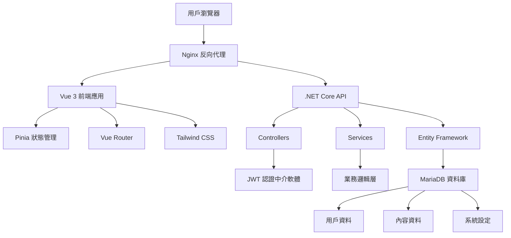

# Personal Manager 開發指南

## 📋 目錄

1. [專案概述](#專案概述)
2. [開發環境設定](#開發環境設定)
3. [專案架構](#專案架構)
4. [開發工作流程](#開發工作流程)
5. [程式碼規範](#程式碼規範)
6. [測試指南](#測試指南)
7. [部署指南](#部署指南)
8. [故障排除](#故障排除)
9. [貢獻指南](#貢獻指南)

---

## 專案概述

### 🎯 專案目標
Personal Manager 是一個現代化的個人展示與管理平台，旨在提供：
- 專業的個人作品集展示
- 完整的內容管理系統
- 響應式的用戶體驗
- 可擴展的技術架構

### 🛠️ 技術棧

**前端技術：**
- **框架**: Vue 3.5 + Composition API
- **語言**: TypeScript 5.8
- **建置工具**: Vite 7.0
- **狀態管理**: Pinia 3.0
- **路由**: Vue Router 4.5
- **樣式**: Tailwind CSS 4.1
- **HTTP 客戶端**: Axios 1.11
- **測試**: Vitest 3.2 + Playwright 1.54

**後端技術：**
- **框架**: .NET Core 8.0 Web API
- **語言**: C# 12
- **資料庫**: MariaDB 10.6+
- **ORM**: Entity Framework Core 8.0
- **認證**: JWT Bearer Token
- **API 文檔**: Swagger/OpenAPI 3.0
- **測試**: xUnit + Moq

**開發工具：**
- **版本控制**: Git + GitHub
- **IDE**: Visual Studio Code
- **容器化**: Docker + Docker Compose
- **CI/CD**: GitHub Actions
- **部署**: Zeabur Platform

### 📊 專案統計
```
代碼行數統計 (不含註解):
┌─────────────────────────────────────┐
│ 前端 TypeScript/Vue: ~15,000 行    │
│ 後端 C#: ~8,000 行                 │
│ 測試代碼: ~5,000 行                │
│ 文檔和配置: ~2,000 行              │
│ 總計: ~30,000 行                   │
└─────────────────────────────────────┘
```

---

## 開發環境設定

### 📋 系統需求

**必要軟體：**
- Node.js 20.19.0+ 或 22.12.0+
- .NET 8.0 SDK
- MariaDB 10.6+ 或 MySQL 8.0+
- Git 2.30+

**推薦軟體：**
- Visual Studio Code
- Docker Desktop
- Postman 或 Insomnia (API 測試)
- HeidiSQL 或 MySQL Workbench (資料庫管理)

### 🚀 快速開始

#### 1. 克隆專案倉庫
```bash
# 主專案倉庫
git clone https://github.com/hn83320589/personal_manager.git
cd personal_manager

# 後端專案 
git clone https://github.com/hn83320589/PersonalManagerBackend.git PersonalManagerBackend

# 前端專案
git clone https://github.com/hn83320589/PersonalManagerFrontend.git PersonalManagerFrontend
```

#### 2. 環境配置
```bash
# 複製環境配置檔案
cp PersonalManagerBackend/appsettings.example.json PersonalManagerBackend/appsettings.Development.json
cp PersonalManagerFrontend/.env.example PersonalManagerFrontend/.env.development
```

#### 3. 資料庫設定
```bash
# 啟動 MariaDB (使用 Docker)
docker run -d \
  --name personal-manager-db \
  -e MYSQL_ROOT_PASSWORD=rootpassword \
  -e MYSQL_DATABASE=personal_manager \
  -e MYSQL_USER=pm_user \
  -e MYSQL_PASSWORD=pm_password \
  -p 3306:3306 \
  mariadb:10.6

# 或使用 Docker Compose
cd PersonalManagerBackend
docker-compose up -d database
```

#### 4. 後端啟動
```bash
cd PersonalManagerBackend

# 安裝相依套件 (首次執行)
dotnet restore

# 執行資料庫遷移
dotnet ef database update

# 啟動開發伺服器
dotnet run
# 或使用 watch 模式 (自動重新載入)
dotnet watch run
```

#### 5. 前端啟動
```bash
cd PersonalManagerFrontend

# 安裝相依套件
npm install

# 啟動開發伺服器
npm run dev
```

#### 6. 驗證安裝
```bash
# 檢查後端 API
curl http://localhost:5253/api/users

# 檢查前端頁面
# 瀏覽器開啟 http://localhost:5173
```

### 🔧 開發環境配置詳解

#### Visual Studio Code 設定
```json
// .vscode/settings.json
{
  "typescript.preferences.importModuleSpecifier": "relative",
  "editor.formatOnSave": true,
  "editor.codeActionsOnSave": {
    "source.fixAll.eslint": true
  },
  "files.associations": {
    "*.vue": "vue"
  }
}

// .vscode/extensions.json
{
  "recommendations": [
    "Vue.volar",
    "ms-vscode.vscode-typescript-next",
    "bradlc.vscode-tailwindcss",
    "ms-dotnettools.csharp",
    "ms-dotnettools.vscode-dotnet-runtime"
  ]
}
```

#### 環境變數設定

**後端環境變數 (appsettings.Development.json):**
```json
{
  "ConnectionStrings": {
    "DefaultConnection": "Server=localhost;Database=personal_manager;User=pm_user;Password=pm_password;"
  },
  "Logging": {
    "LogLevel": {
      "Default": "Information",
      "Microsoft.AspNetCore": "Warning"
    }
  },
  "AllowedHosts": "*",
  "Cors": {
    "AllowedOrigins": ["http://localhost:5173"]
  }
}
```

**前端環境變數 (.env.development):**
```env
# API Base URL
VITE_API_BASE_URL=http://localhost:5253/api

# 應用程式設定
VITE_APP_TITLE=Personal Manager
VITE_APP_VERSION=1.0.0

# 偵錯模式
VITE_DEBUG_MODE=true
```

---

## 專案架構

### 📁 目錄結構

```
personal_manager/
├── README.md                          # 專案說明
├── CLAUDE.md                          # AI 開發指引
├── .gitignore                         # Git 忽略檔案
├── personal_manager.sln               # Visual Studio 解決方案
├── docs/                              # 專案文檔
│   ├── api-documentation.md           # API 技術文檔
│   ├── database-design.md             # 資料庫設計
│   ├── deployment-guide.md            # 部署指南
│   ├── user-manual.md                 # 使用者手冊
│   ├── development-guide.md           # 開發指南 (本檔案)
│   └── feature-overview.md            # 功能概覽
├── PersonalManagerBackend/            # 後端專案
│   ├── Controllers/                   # API 控制器
│   ├── Models/                        # 資料模型
│   ├── Services/                      # 業務邏輯服務
│   ├── Data/                          # 資料訪問層
│   ├── DTOs/                          # 資料傳輸物件
│   ├── Middleware/                    # 中介軟體
│   ├── Configuration/                 # 設定檔
│   ├── DB/                            # 資料庫腳本
│   ├── wwwroot/                       # 靜態檔案
│   ├── Tests/                         # 測試專案
│   ├── Program.cs                     # 應用程式進入點
│   ├── appsettings.json               # 應用程式設定
│   └── PersonalManagerAPI.csproj     # 專案檔
└── PersonalManagerFrontend/           # 前端專案
    ├── src/                           # 原始碼
    │   ├── components/                # Vue 元件
    │   │   ├── common/                # 共用元件
    │   │   ├── layout/                # 佈局元件
    │   │   └── ui/                    # UI 元件
    │   ├── views/                     # 頁面元件
    │   │   ├── admin/                 # 管理頁面
    │   │   └── auth/                  # 認證頁面
    │   ├── stores/                    # Pinia 狀態管理
    │   ├── services/                  # API 服務
    │   ├── router/                    # 路由設定
    │   ├── types/                     # TypeScript 型別
    │   ├── utils/                     # 工具函式
    │   ├── assets/                    # 靜態資源
    │   ├── styles/                    # 樣式檔案
    │   └── main.ts                    # 應用程式進入點
    ├── public/                        # 公共資源
    ├── tests/                         # 測試檔案
    ├── e2e/                           # E2E 測試
    ├── package.json                   # NPM 設定
    ├── vite.config.ts                 # Vite 設定
    ├── tailwind.config.js             # Tailwind 設定
    └── tsconfig.json                  # TypeScript 設定
```

### 🏗️ 系統架構圖



### 🎯 模組設計

#### 前端模組架構
```typescript
// 狀態管理模組
interface StoreModule {
  state: reactive state objects
  getters: computed properties  
  actions: async business logic
  persist: local storage options
}

// API 服務模組
interface APIService {
  baseURL: string
  endpoints: CRUD operations
  interceptors: request/response handling
  errorHandling: unified error management
}

// UI 元件模組  
interface UIComponent {
  props: component properties
  emits: event definitions
  slots: content projection
  styles: Tailwind CSS classes
}
```

#### 後端模組架構
```csharp
// 控制器模組
public abstract class BaseController : ControllerBase
{
    protected ApiResponse<T> Success<T>(T data);
    protected ApiResponse<T> Error<T>(string message);
    protected ApiResponse<T> NotFound<T>(string message);
}

// 服務模組
public interface IService<T>
{
    Task<IEnumerable<T>> GetAllAsync();
    Task<T> GetByIdAsync(int id);
    Task<T> CreateAsync(T entity);
    Task<T> UpdateAsync(T entity);
    Task DeleteAsync(int id);
}

// 資料存取模組
public class Repository<T> : IRepository<T> where T : class
{
    protected readonly ApplicationDbContext _context;
    protected readonly DbSet<T> _dbSet;
}
```

---

## 開發工作流程

### 🔄 Git 工作流程

#### 分支策略
```
main (主分支)
├── develop (開發分支)
│   ├── feature/user-auth (功能分支)
│   ├── feature/portfolio-management
│   └── feature/blog-system
├── hotfix/critical-bug (熱修復分支)
└── release/v1.0.0 (發布分支)
```

#### 提交訊息規範
```bash
# 格式: <type>(<scope>): <description>
# 範例:
feat(auth): add JWT token refresh mechanism
fix(portfolio): resolve image upload validation issue
docs(api): update API documentation for blog endpoints
test(frontend): add unit tests for auth store
refactor(backend): improve error handling in user service
```

#### 開發流程
```bash
# 1. 建立功能分支
git checkout develop
git pull origin develop
git checkout -b feature/new-feature

# 2. 開發功能
# ... coding ...

# 3. 提交變更
git add .
git commit -m "feat(feature): implement new feature"

# 4. 推送分支
git push origin feature/new-feature

# 5. 建立 Pull Request
# 通過 GitHub 介面建立 PR

# 6. 代碼審查和合併
# 審查通過後合併到 develop 分支
```

### 🧪 開發測試流程

#### 前端測試流程
```bash
# 單元測試
npm run test:unit

# E2E 測試  
npm run test:e2e

# 類型檢查
npm run type-check

# 程式碼檢查
npm run lint

# 建置測試
npm run build
```

#### 後端測試流程
```bash
# 單元測試
dotnet test

# 整合測試
dotnet test --filter Category=Integration

# 程式碼覆蓋率
dotnet test --collect:"XPlat Code Coverage"

# API 測試 (使用 Postman/Newman)
newman run PersonalManager-API-Tests.postman_collection.json
```

### 📝 代碼審查檢查清單

#### 前端代碼審查
- [ ] TypeScript 類型安全
- [ ] Vue 3 Composition API 最佳實踐
- [ ] 響應式設計實作
- [ ] 無障礙性 (a11y) 考量
- [ ] 效能最佳化 (懶載入、程式碼分割)
- [ ] 錯誤處理完整性
- [ ] 測試覆蓋率符合標準

#### 後端代碼審查
- [ ] API 設計符合 RESTful 原則
- [ ] 資料驗證完整性
- [ ] 安全性考量 (認證、授權、輸入驗證)
- [ ] 資料庫查詢最佳化
- [ ] 錯誤處理和日誌記錄
- [ ] 單元測試覆蓋率
- [ ] API 文檔更新

---

## 程式碼規範

### 📝 命名規範

#### TypeScript/Vue 命名規範
```typescript
// 檔案命名: kebab-case
user-profile.vue
auth-service.ts
api-client.ts

// 變數命名: camelCase
const userName = 'john'
const isLoggedIn = true
const userPreferences = {}

// 常數命名: UPPER_SNAKE_CASE
const API_BASE_URL = 'https://api.example.com'
const MAX_FILE_SIZE = 10 * 1024 * 1024

// 類別命名: PascalCase
class UserService {}
interface ApiResponse {}
type UserRole = 'admin' | 'user'

// 元件命名: PascalCase
export default defineComponent({
  name: 'UserProfile'
})
```

#### C# 命名規範
```csharp
// 類別命名: PascalCase
public class UserService {}
public interface IUserService {}

// 方法命名: PascalCase
public async Task<User> GetUserByIdAsync(int id) {}

// 屬性命名: PascalCase
public string UserName { get; set; }
public bool IsActive { get; set; }

// 欄位命名: _camelCase (私有), PascalCase (公有)
private readonly ILogger _logger;
public const string DefaultRole = "User";

// 參數命名: camelCase
public void UpdateUser(int userId, string userName) {}
```

### 🎨 程式碼格式化

#### TypeScript/Vue 格式化設定
```json
// .prettierrc
{
  "semi": false,
  "singleQuote": true,
  "tabWidth": 2,
  "trailingComma": "es5",
  "printWidth": 100,
  "endOfLine": "lf"
}

// .eslintrc.js
module.exports = {
  extends: [
    '@vue/typescript/recommended',
    '@vue/prettier',
    '@vue/prettier/@typescript-eslint'
  ],
  rules: {
    'no-console': process.env.NODE_ENV === 'production' ? 'warn' : 'off',
    'no-debugger': process.env.NODE_ENV === 'production' ? 'warn' : 'off',
    '@typescript-eslint/no-unused-vars': 'error'
  }
}
```

#### C# 格式化設定
```xml
<!-- .editorconfig -->
root = true

[*.cs]
indent_style = space
indent_size = 4
end_of_line = crlf
charset = utf-8
trim_trailing_whitespace = true
insert_final_newline = true

# C# 程式碼規則
dotnet_naming_rule.interfaces_should_be_prefixed_with_i.severity = warning
dotnet_naming_rule.types_should_be_pascal_case.severity = warning
dotnet_naming_rule.non_field_members_should_be_pascal_case.severity = warning
```

### 📋 程式碼註解規範

#### TypeScript 註解
```typescript
/**
 * 使用者服務類別
 * 處理所有與使用者相關的 API 操作
 */
export class UserService {
  /**
   * 根據 ID 獲取使用者資訊
   * @param id 使用者 ID
   * @returns Promise 包含使用者資訊
   * @throws {Error} 當使用者不存在時拋出錯誤
   */
  async getUserById(id: number): Promise<User> {
    // 實作內容...
  }
}
```

#### C# 註解
```csharp
/// <summary>
/// 使用者服務類別，提供使用者相關的業務邏輯
/// </summary>
public class UserService : IUserService
{
    /// <summary>
    /// 根據 ID 異步獲取使用者資訊
    /// </summary>
    /// <param name="id">使用者唯一識別碼</param>
    /// <returns>包含使用者資訊的 Task</returns>
    /// <exception cref="NotFoundException">當使用者不存在時拋出</exception>
    public async Task<User> GetUserByIdAsync(int id)
    {
        // 實作內容...
    }
}
```

---

## 測試指南

### 🧪 測試策略

#### 測試金字塔
```
    ╭─────────────╮
   ╱   E2E Tests   ╲     ← 少量，測試關鍵用戶流程
  ╱                 ╲
 ╱  Integration Tests ╲  ← 中量，測試模組間整合
╱                     ╲
╲   Unit Tests       ╱   ← 大量，測試個別函式/類別
 ╲                 ╱
  ╲_______________╱

測試比例建議:
- Unit Tests: 70%
- Integration Tests: 20%  
- E2E Tests: 10%
```

### 🔍 前端測試

#### 單元測試範例 (Vitest)
```typescript
// stores/__tests__/auth.spec.ts
import { describe, it, expect, beforeEach } from 'vitest'
import { setActivePinia, createPinia } from 'pinia'
import { useAuthStore } from '../auth'

describe('AuthStore', () => {
  beforeEach(() => {
    setActivePinia(createPinia())
  })

  it('should initialize with correct default state', () => {
    const store = useAuthStore()
    
    expect(store.user).toBeNull()
    expect(store.token).toBeNull()
    expect(store.isAuthenticated).toBe(false)
  })

  it('should login successfully with valid credentials', async () => {
    const store = useAuthStore()
    
    const result = await store.login({
      username: 'admin',
      password: 'demo123'
    })
    
    expect(result).toBe(true)
    expect(store.user).toBeDefined()
    expect(store.token).toBeDefined()
    expect(store.isAuthenticated).toBe(true)
  })
})
```

#### 元件測試範例
```typescript
// components/__tests__/BaseButton.spec.ts
import { describe, it, expect } from 'vitest'
import { mount } from '@vue/test-utils'
import BaseButton from '../BaseButton.vue'

describe('BaseButton', () => {
  it('should render button text correctly', () => {
    const wrapper = mount(BaseButton, {
      slots: {
        default: 'Click Me'
      }
    })
    
    expect(wrapper.text()).toContain('Click Me')
    expect(wrapper.element.tagName).toBe('BUTTON')
  })

  it('should emit click event when clicked', async () => {
    const wrapper = mount(BaseButton)
    
    await wrapper.trigger('click')
    
    expect(wrapper.emitted()).toHaveProperty('click')
    expect(wrapper.emitted().click).toHaveLength(1)
  })
})
```

#### E2E 測試範例 (Playwright)
```typescript
// e2e/auth.spec.ts
import { test, expect } from '@playwright/test'

test.describe('使用者認證', () => {
  test('should login with demo credentials', async ({ page }) => {
    await page.goto('/login')
    
    // 填寫登入表單
    await page.fill('input[type="text"]', 'admin')
    await page.fill('input[type="password"]', 'demo123')
    await page.click('button[type="submit"]')
    
    // 驗證登入成功
    await expect(page.url()).toContain('/admin/dashboard')
    await expect(page.locator('text=管理儀表板')).toBeVisible()
  })

  test('should handle invalid credentials', async ({ page }) => {
    await page.goto('/login')
    
    await page.fill('input[type="text"]', 'invalid')
    await page.fill('input[type="password"]', 'invalid')
    await page.click('button[type="submit"]')
    
    // 驗證錯誤訊息
    await expect(page.locator('text=登入失敗')).toBeVisible()
  })
})
```

### 🔧 後端測試

#### 單元測試範例 (xUnit)
```csharp
// Tests/Services/UserServiceTests.cs
public class UserServiceTests
{
    private readonly Mock<IUserRepository> _mockRepository;
    private readonly UserService _userService;

    public UserServiceTests()
    {
        _mockRepository = new Mock<IUserRepository>();
        _userService = new UserService(_mockRepository.Object);
    }

    [Fact]
    public async Task GetUserByIdAsync_WithValidId_ReturnsUser()
    {
        // Arrange
        var userId = 1;
        var expectedUser = new User { Id = userId, Username = "testuser" };
        _mockRepository.Setup(r => r.GetByIdAsync(userId))
                      .ReturnsAsync(expectedUser);

        // Act
        var result = await _userService.GetUserByIdAsync(userId);

        // Assert
        Assert.Equal(expectedUser.Id, result.Id);
        Assert.Equal(expectedUser.Username, result.Username);
    }

    [Fact]
    public async Task GetUserByIdAsync_WithInvalidId_ThrowsNotFoundException()
    {
        // Arrange
        var userId = 999;
        _mockRepository.Setup(r => r.GetByIdAsync(userId))
                      .ReturnsAsync((User)null);

        // Act & Assert
        await Assert.ThrowsAsync<NotFoundException>(
            () => _userService.GetUserByIdAsync(userId));
    }
}
```

#### 整合測試範例
```csharp
// Tests/Integration/UsersControllerTests.cs
public class UsersControllerTests : IClassFixture<WebApplicationFactory<Program>>
{
    private readonly WebApplicationFactory<Program> _factory;
    private readonly HttpClient _client;

    public UsersControllerTests(WebApplicationFactory<Program> factory)
    {
        _factory = factory;
        _client = _factory.CreateClient();
    }

    [Fact]
    public async Task GetUsers_ReturnsSuccessResponse()
    {
        // Arrange & Act
        var response = await _client.GetAsync("/api/users");

        // Assert
        response.EnsureSuccessStatusCode();
        var content = await response.Content.ReadAsStringAsync();
        var apiResponse = JsonSerializer.Deserialize<ApiResponse<List<User>>>(content);
        
        Assert.True(apiResponse.Success);
        Assert.NotNull(apiResponse.Data);
    }
}
```

### 📊 測試覆蓋率

#### 前端測試覆蓋率設定
```typescript
// vitest.config.ts
export default defineConfig({
  test: {
    coverage: {
      provider: 'v8',
      reporter: ['text', 'json', 'html'],
      exclude: [
        'node_modules/**',
        'tests/**',
        '**/*.d.ts',
        '**/*.config.*',
      ],
      thresholds: {
        global: {
          branches: 80,
          functions: 80,
          lines: 80,
          statements: 80
        }
      }
    }
  }
})
```

#### 後端測試覆蓋率設定
```xml
<!-- Directory.Build.props -->
<Project>
  <PropertyGroup>
    <CollectCoverage>true</CollectCoverage>
    <CoverletOutputFormat>opencover</CoverletOutputFormat>
    <CoverletOutput>./coverage/</CoverletOutput>
    <Threshold>80</Threshold>
    <ThresholdType>line,branch,method</ThresholdType>
  </PropertyGroup>
</Project>
```

### 🚀 測試自動化

#### GitHub Actions 測試流程
```yaml
# .github/workflows/test.yml
name: Tests

on: [push, pull_request]

jobs:
  frontend-tests:
    runs-on: ubuntu-latest
    steps:
      - uses: actions/checkout@v4
      - uses: actions/setup-node@v4
        with:
          node-version: '20'
          cache: 'npm'
          cache-dependency-path: PersonalManagerFrontend/package-lock.json
      
      - name: Install dependencies
        run: npm ci
        working-directory: PersonalManagerFrontend
      
      - name: Run type check
        run: npm run type-check
        working-directory: PersonalManagerFrontend
      
      - name: Run unit tests
        run: npm run test:unit -- --coverage
        working-directory: PersonalManagerFrontend
      
      - name: Run E2E tests
        run: npm run test:e2e
        working-directory: PersonalManagerFrontend

  backend-tests:
    runs-on: ubuntu-latest
    services:
      mysql:
        image: mariadb:10.6
        env:
          MYSQL_ROOT_PASSWORD: rootpassword
          MYSQL_DATABASE: personal_manager_test
        options: >-
          --health-cmd="mysqladmin ping"
          --health-interval=10s
          --health-timeout=5s
          --health-retries=3
    
    steps:
      - uses: actions/checkout@v4
      - uses: actions/setup-dotnet@v4
        with:
          dotnet-version: '8.0.x'
      
      - name: Restore dependencies
        run: dotnet restore
        working-directory: PersonalManagerBackend
      
      - name: Run tests
        run: dotnet test --logger trx --collect:"XPlat Code Coverage"
        working-directory: PersonalManagerBackend
        env:
          ConnectionStrings__DefaultConnection: "Server=localhost;Database=personal_manager_test;User=root;Password=rootpassword;"
```

---

## 部署指南

### 🚀 部署環境

#### 開發環境 (Development)
- **目的**: 本地開發和測試
- **資料庫**: 本地 MariaDB
- **API**: http://localhost:5253
- **前端**: http://localhost:5173
- **特色**: 熱重載、除錯模式、詳細日誌

#### 測試環境 (Staging)
- **目的**: 功能測試和驗收
- **資料庫**: 雲端測試資料庫
- **部署**: 自動化部署
- **特色**: 生產環境配置、測試資料

#### 生產環境 (Production)
- **目的**: 正式服務
- **資料庫**: 生產資料庫（高可用性）
- **部署**: Zeabur 平台
- **特色**: HTTPS、CDN、監控、備份

### 🐳 Docker 容器化

#### Dockerfile 範例

**後端 Dockerfile:**
```dockerfile
# PersonalManagerBackend/Dockerfile
FROM mcr.microsoft.com/dotnet/aspnet:8.0 AS base
WORKDIR /app
EXPOSE 8080

FROM mcr.microsoft.com/dotnet/sdk:8.0 AS build
WORKDIR /src
COPY ["PersonalManagerAPI.csproj", "."]
RUN dotnet restore "PersonalManagerAPI.csproj"
COPY . .
WORKDIR "/src"
RUN dotnet build "PersonalManagerAPI.csproj" -c Release -o /app/build

FROM build AS publish
RUN dotnet publish "PersonalManagerAPI.csproj" -c Release -o /app/publish

FROM base AS final
WORKDIR /app
COPY --from=publish /app/publish .
ENTRYPOINT ["dotnet", "PersonalManagerAPI.dll"]
```

**前端 Dockerfile:**
```dockerfile
# PersonalManagerFrontend/Dockerfile
FROM node:20-alpine AS build
WORKDIR /app
COPY package*.json ./
RUN npm ci --only=production
COPY . .
RUN npm run build

FROM nginx:alpine AS production
COPY --from=build /app/dist /usr/share/nginx/html
COPY nginx.conf /etc/nginx/conf.d/default.conf
EXPOSE 80
CMD ["nginx", "-g", "daemon off;"]
```

#### Docker Compose 設定
```yaml
# docker-compose.yml
version: '3.8'

services:
  database:
    image: mariadb:10.6
    environment:
      MYSQL_ROOT_PASSWORD: ${DB_ROOT_PASSWORD}
      MYSQL_DATABASE: ${DB_NAME}
      MYSQL_USER: ${DB_USER}
      MYSQL_PASSWORD: ${DB_PASSWORD}
    volumes:
      - db_data:/var/lib/mysql
    ports:
      - "3306:3306"
    networks:
      - personal-manager-network

  backend:
    build:
      context: ./PersonalManagerBackend
      dockerfile: Dockerfile
    environment:
      - ConnectionStrings__DefaultConnection=Server=database;Database=${DB_NAME};User=${DB_USER};Password=${DB_PASSWORD};
      - ASPNETCORE_ENVIRONMENT=Production
    depends_on:
      - database
    ports:
      - "8080:8080"
    networks:
      - personal-manager-network

  frontend:
    build:
      context: ./PersonalManagerFrontend
      dockerfile: Dockerfile
    environment:
      - VITE_API_BASE_URL=http://backend:8080/api
    depends_on:
      - backend
    ports:
      - "80:80"
    networks:
      - personal-manager-network

volumes:
  db_data:

networks:
  personal-manager-network:
    driver: bridge
```

### ☁️ Zeabur 部署

#### 專案設定
```yaml
# zeabur.json
{
  "name": "personal-manager",
  "services": [
    {
      "name": "backend",
      "source": {
        "type": "git",
        "url": "https://github.com/hn83320589/PersonalManagerBackend"
      },
      "environment": {
        "ASPNETCORE_ENVIRONMENT": "Production"
      }
    },
    {
      "name": "frontend",
      "source": {
        "type": "git", 
        "url": "https://github.com/hn83320589/PersonalManagerFrontend"
      },
      "environment": {
        "VITE_API_BASE_URL": "${backend.url}/api"
      }
    },
    {
      "name": "database",
      "type": "mysql",
      "version": "8.0"
    }
  ]
}
```

#### 環境變數設定
```bash
# 生產環境變數
DB_HOST=<zeabur-mysql-host>
DB_NAME=personal_manager
DB_USER=<zeabur-mysql-user>
DB_PASSWORD=<zeabur-mysql-password>

# JWT 設定
JWT_SECRET=<strong-random-secret>
JWT_ISSUER=PersonalManager
JWT_AUDIENCE=PersonalManagerUsers

# CORS 設定
CORS_ORIGINS=https://your-domain.com
```

### 🔄 CI/CD 流程

#### GitHub Actions 部署
```yaml
# .github/workflows/deploy.yml
name: Deploy to Production

on:
  push:
    branches: [main]

jobs:
  deploy-backend:
    runs-on: ubuntu-latest
    steps:
      - uses: actions/checkout@v4
      
      - name: Setup .NET
        uses: actions/setup-dotnet@v4
        with:
          dotnet-version: '8.0.x'
      
      - name: Run tests
        run: dotnet test
        working-directory: PersonalManagerBackend
      
      - name: Deploy to Zeabur
        uses: zeabur/deploy-action@v1
        with:
          service-name: backend
          zeabur-token: ${{ secrets.ZEABUR_TOKEN }}

  deploy-frontend:
    runs-on: ubuntu-latest
    needs: deploy-backend
    steps:
      - uses: actions/checkout@v4
      
      - name: Setup Node.js
        uses: actions/setup-node@v4
        with:
          node-version: '20'
          cache: 'npm'
          cache-dependency-path: PersonalManagerFrontend/package-lock.json
      
      - name: Install and test
        run: |
          npm ci
          npm run type-check
          npm run test:unit
          npm run build
        working-directory: PersonalManagerFrontend
      
      - name: Deploy to Zeabur
        uses: zeabur/deploy-action@v1
        with:
          service-name: frontend
          zeabur-token: ${{ secrets.ZEABUR_TOKEN }}
```

### 📊 監控和維護

#### 健康檢查端點
```csharp
// HealthController.cs
[ApiController]
[Route("api/[controller]")]
public class HealthController : ControllerBase
{
    private readonly ApplicationDbContext _context;

    [HttpGet]
    public async Task<IActionResult> Get()
    {
        try
        {
            // 檢查資料庫連線
            await _context.Database.CanConnectAsync();
            
            return Ok(new
            {
                Status = "Healthy",
                Timestamp = DateTime.UtcNow,
                Version = "1.0.0"
            });
        }
        catch (Exception ex)
        {
            return StatusCode(500, new
            {
                Status = "Unhealthy",
                Error = ex.Message,
                Timestamp = DateTime.UtcNow
            });
        }
    }
}
```

#### 應用程式監控
```typescript
// monitoring.ts
export class MonitoringService {
  // 效能監控
  static trackPageLoad(pageName: string, loadTime: number) {
    // 發送到 Google Analytics 或其他服務
    gtag('event', 'page_load_time', {
      page_name: pageName,
      value: loadTime
    })
  }

  // 錯誤追蹤
  static trackError(error: Error, context?: any) {
    console.error('Application Error:', error, context)
    
    // 發送到錯誤追蹤服務 (如 Sentry)
    if (window.Sentry) {
      window.Sentry.captureException(error, {
        extra: context
      })
    }
  }

  // 使用者行為追蹤
  static trackUserAction(action: string, data?: any) {
    gtag('event', action, data)
  }
}
```

---

## 故障排除

### 🔧 常見問題

#### 前端開發問題

**Q: npm install 失敗**
```bash
# 解決方案
# 1. 清除 npm 快取
npm cache clean --force

# 2. 刪除 node_modules 和 package-lock.json
rm -rf node_modules package-lock.json

# 3. 重新安裝
npm install

# 4. 如果仍然失敗，檢查 Node.js 版本
node --version  # 需要 20.19.0+ 或 22.12.0+
```

**Q: TypeScript 編譯錯誤**
```bash
# 解決方案
# 1. 檢查 tsconfig.json 設定
# 2. 確認型別定義檔案存在
npm install --save-dev @types/node

# 3. 重新啟動 TypeScript 服務
# VS Code: Ctrl+Shift+P -> "TypeScript: Restart TS Server"
```

**Q: Tailwind CSS 樣式不生效**
```bash
# 解決方案
# 1. 確認 tailwind.config.js 設定正確
# 2. 檢查 CSS 引入
# 3. 重新建置
npm run build

# 4. 清除瀏覽器快取
```

#### 後端開發問題

**Q: 資料庫連線失敗**
```bash
# 解決方案
# 1. 檢查 MariaDB 服務狀態
docker ps  # 確認容器運行

# 2. 測試資料庫連線
mysql -h localhost -u pm_user -p personal_manager

# 3. 檢查連線字串
# appsettings.Development.json

# 4. 重新建立資料庫
dotnet ef database drop
dotnet ef database update
```

**Q: JWT Token 驗證失敗**
```bash
# 解決方案
# 1. 檢查 Token 格式
# 2. 驗證簽章密鑰
# 3. 確認 Token 未過期
# 4. 檢查 CORS 設定
```

**Q: API 回應 500 錯誤**
```bash
# 解決方案
# 1. 檢查應用程式日誌
dotnet run --verbosity detailed

# 2. 檢查資料庫遷移狀態
dotnet ef migrations list

# 3. 驗證模型驗證規則
# 4. 檢查依賴注入設定
```

### 🐛 偵錯技巧

#### 前端偵錯
```typescript
// 1. Vue DevTools 使用
// 安裝 Vue DevTools 瀏覽器擴充套件

// 2. 條件斷點
if (user.id === 123) {
  debugger; // 只在特定條件下觸發
}

// 3. 效能分析
console.time('API Call');
await userService.getUsers();
console.timeEnd('API Call');

// 4. 網路請求監控
// 使用瀏覽器開發者工具 Network 標籤
```

#### 後端偵錯
```csharp
// 1. 設定中斷點
// 在 Visual Studio Code 中點擊行號左側

// 2. 條件中斷點
if (user.Id == 123)
{
    System.Diagnostics.Debugger.Break(); // 條件觸發
}

// 3. 日誌記錄
_logger.LogInformation("Processing user {UserId}", user.Id);
_logger.LogWarning("User {UserId} not found", userId);
_logger.LogError(ex, "Error processing user {UserId}", userId);

// 4. 資料庫查詢分析
_context.Database.Log = Console.WriteLine; // 顯示 SQL 查詢
```

### 📋 效能最佳化

#### 前端效能最佳化
```typescript
// 1. 懶載入路由
const routes = [
  {
    path: '/admin',
    component: () => import('../views/admin/DashboardView.vue')
  }
]

// 2. 元件懶載入
export default defineAsyncComponent(() => import('./HeavyComponent.vue'))

// 3. 圖片最佳化


// 4. 虛擬列表 (大量資料)
import { FixedSizeList as List } from 'react-window'
```

#### 後端效能最佳化
```csharp
// 1. 資料庫查詢最佳化
var users = await _context.Users
    .Where(u => u.IsActive)
    .Include(u => u.Profile)
    .AsNoTracking() // 唯讀查詢
    .ToListAsync();

// 2. 快取機制
[ResponseCache(Duration = 300)] // 5 分鐘快取
public async Task<IActionResult> GetUsers()

// 3. 分頁查詢
public async Task<PagedResult<User>> GetUsersAsync(int page, int size)
{
    var query = _context.Users.AsQueryable();
    var total = await query.CountAsync();
    var users = await query
        .Skip((page - 1) * size)
        .Take(size)
        .ToListAsync();
    
    return new PagedResult<User>(users, total, page, size);
}

// 4. 非同步處理
public async Task ProcessLargeDataAsync()
{
    await Task.Run(() => {
        // CPU 密集型工作
    });
}
```

---

## 貢獻指南

### 🤝 如何貢獻

#### 報告問題
1. **檢查現有 Issues** - 確認問題尚未被報告
2. **建立詳細 Issue** - 包含重現步驟、環境資訊、預期行為
3. **提供範例** - 最小重現案例或螢幕截圖
4. **標記適當標籤** - bug、enhancement、question 等

#### 提交程式碼
1. **Fork 專案** - 建立自己的副本
2. **建立分支** - 從 develop 分支建立功能分支
3. **遵循規範** - 程式碼風格、提交訊息、測試要求
4. **提交 PR** - 包含清楚的描述和測試結果
5. **回應審查** - 配合 Code Review 建議修改

#### 貢獻類型
- 🐛 **Bug 修復** - 修正系統錯誤
- ✨ **新功能** - 增加新的功能特色
- 📝 **文檔改進** - 更新或改善文檔
- 🧪 **測試增強** - 增加或改進測試覆蓋率
- 🔧 **工具改進** - 改善開發工具和流程
- 🎨 **UI/UX 改進** - 提升使用者介面和體驗

### 📝 Issue 模板

#### Bug 報告模板
```markdown
## Bug 描述
簡要描述遇到的問題

## 重現步驟
1. 進入 '...'
2. 點擊 '....'
3. 滾動到 '....'
4. 看到錯誤

## 預期行為
描述您期望發生的行為

## 實際行為
描述實際發生的行為

## 螢幕截圖
如果適用，請添加螢幕截圖

## 環境資訊
- OS: [e.g. Windows 10, macOS 12]
- 瀏覽器: [e.g. Chrome 91, Firefox 89]
- 版本: [e.g. v1.0.0]

## 額外資訊
其他相關資訊或上下文
```

#### 功能請求模板
```markdown
## 功能描述
簡要描述您希望的功能

## 問題解決
這個功能解決了什麼問題？

## 解決方案
描述您希望的解決方案

## 替代方案
描述您考慮過的替代解決方案

## 額外資訊
其他相關資訊、模型或參考資料
```

### 🏆 貢獻者獎勵

#### 認可制度
- **🥇 核心貢獻者** - 持續貢獻重要功能和修復
- **🥈 活躍貢獻者** - 定期提供有價值的貢獻
- **🥉 社群貢獻者** - 幫助改進文檔和回答問題

#### 貢獻統計
```
目前貢獻者統計:
┌─────────────────────────────────────┐
│ 總提交數: 1,234                    │
│ 貢獻者數: 45                       │
│ 開放 Issues: 12                    │
│ 已解決 Issues: 89                  │
│ Pull Requests: 156                 │
└─────────────────────────────────────┘
```

### 📞 聯絡方式

- **專案維護者**: [GitHub @hn83320589](https://github.com/hn83320589)
- **技術討論**: [GitHub Discussions](https://github.com/hn83320589/personal_manager/discussions)
- **問題回報**: [GitHub Issues](https://github.com/hn83320589/personal_manager/issues)
- **即時討論**: [Discord 社群] (待建立)

---

## 📚 參考資源

### 技術文檔
- [Vue 3 官方文檔](https://vuejs.org/)
- [TypeScript 手冊](https://www.typescriptlang.org/docs/)
- [.NET 8 文檔](https://docs.microsoft.com/en-us/dotnet/)
- [Tailwind CSS 文檔](https://tailwindcss.com/docs)
- [Vite 指南](https://vitejs.dev/guide/)

### 最佳實踐
- [Vue 3 風格指南](https://vuejs.org/style-guide/)
- [TypeScript 最佳實踐](https://typescript-eslint.io/rules/)
- [C# 編碼慣例](https://docs.microsoft.com/en-us/dotnet/csharp/fundamentals/coding-style/coding-conventions)
- [RESTful API 設計指南](https://restfulapi.net/)

### 工具和資源
- [Visual Studio Code](https://code.visualstudio.com/)
- [Vue DevTools](https://devtools.vuejs.org/)
- [Postman](https://www.postman.com/)
- [Docker](https://www.docker.com/)
- [GitHub](https://github.com/)

---

**感謝您對 Personal Manager 專案的貢獻！** 🎉

*本開發指南最後更新於 2024年8月15日*