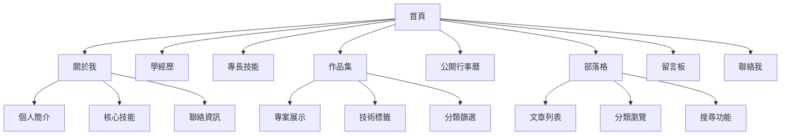
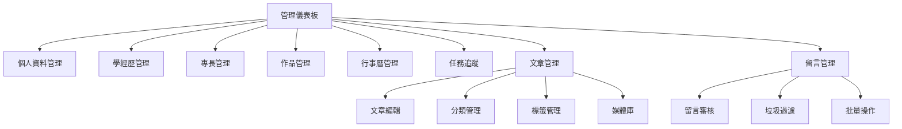
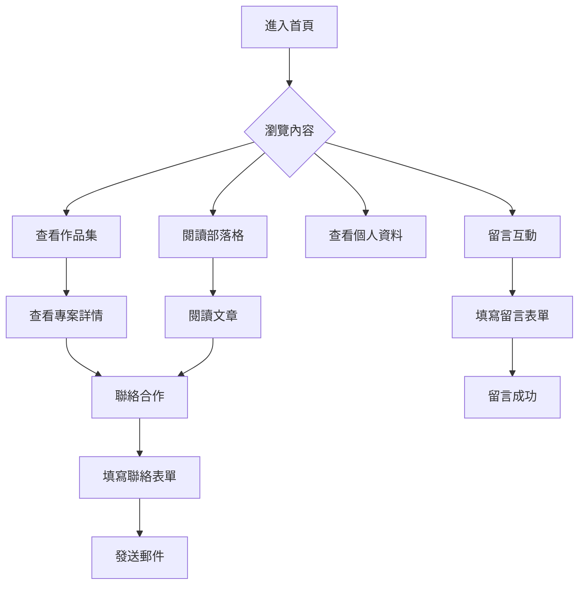
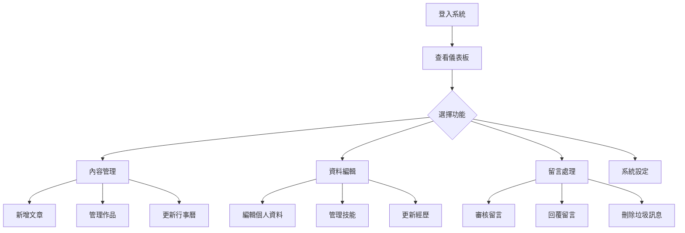

# Personal Manager 功能概覽

## 🎨 系統架構圖

```
┌─────────────────────────────────────────────────────────────┐
│                    Personal Manager                         │
├─────────────────┬───────────────────┬───────────────────────┤
│   公開展示區     │     管理後台      │      API 服務        │
├─────────────────┼───────────────────┼───────────────────────┤
│ • 個人介紹       │ • 內容管理        │ • RESTful API        │
│ • 作品集展示     │ • 資料編輯        │ • JWT 認證           │
│ • 部落格文章     │ • 統計分析        │ • 檔案上傳           │
│ • 留言互動       │ • 系統設定        │ • 資料備份           │
└─────────────────┴───────────────────┴───────────────────────┘
```

## 📊 功能模組總覽

### 🏠 前台展示 (Frontend Display)



### 🔧 後台管理 (Backend Management)



## 🎯 核心功能特色

### 1. 📱 響應式設計
```
桌面版 (1200px+)    平板版 (768px-1199px)    手機版 (< 768px)
┌─────────────────┐  ┌─────────────────┐      ┌─────────────┐
│  Header         │  │  Header         │      │  Header     │
├─────────────────┤  ├─────────────────┤      ├─────────────┤
│ Side │  Main    │  │     Main        │      │    Main     │
│ bar  │ Content  │  │   Content       │      │  Content    │
│      │          │  │                 │      │             │
├─────────────────┤  ├─────────────────┤      ├─────────────┤
│     Footer      │  │     Footer      │      │   Footer    │
└─────────────────┘  └─────────────────┘      └─────────────┘
```

### 2. 🎨 視覺設計系統
```
色彩主題:
┌────────────────────────────────────────────────────────┐
│ 主色調: 淺藍色 #3B82F6  │ 輔助色: 淺灰色 #F8FAFC    │
│ 強調色: 深藍色 #1E40AF  │ 背景色: 白色   #FFFFFF    │
│ 成功色: 綠色   #10B981  │ 錯誤色: 紅色   #EF4444    │
│ 警告色: 橙色   #F59E0B  │ 文字色: 深灰色 #374151    │
└────────────────────────────────────────────────────────┘

字體系統:
┌────────────────────────────────────────────────────────┐
│ 主標題: 32px, font-bold    │ 副標題: 24px, font-semibold │
│ 內文:   16px, font-normal  │ 小字:   14px, font-normal   │
│ 按鈕:   14px, font-medium  │ 說明:   12px, font-normal   │
└────────────────────────────────────────────────────────┘
```

### 3. 📊 資料架構
```
用戶資料結構:
┌─────────────────────────────────────────────────────────┐
│ Users (使用者)                                          │
├─────────────────────────────────────────────────────────┤
│ • PersonalProfiles (個人資料) - 1:1                    │
│ • Educations (學歷) - 1:N                              │
│ • WorkExperiences (工作經歷) - 1:N                     │
│ • Skills (技能) - 1:N                                  │
│ • Portfolios (作品集) - 1:N                            │
│ • CalendarEvents (行事曆) - 1:N                        │
│ • TodoItems (待辦事項) - 1:N                           │
│ • WorkTasks (工作任務) - 1:N                           │
│ • BlogPosts (部落格文章) - 1:N                          │
│ • GuestBookEntries (留言) - 1:N                        │
│ • ContactMethods (聯絡方式) - 1:N                      │
│ • FileUploads (檔案上傳) - 1:N                         │
└─────────────────────────────────────────────────────────┘
```

## 🔄 使用者流程

### 訪客瀏覽流程


### 管理員操作流程


## 🛠️ 技術實作特色

### 前端技術棧
```
框架層:        Vue 3 + Composition API
語言:          TypeScript
建置工具:      Vite
狀態管理:      Pinia
路由:          Vue Router
樣式:          Tailwind CSS
HTTP 客戶端:   Axios
測試:          Vitest + Playwright
```

### 後端技術棧
```
框架:          .NET Core Web API
語言:          C#
資料庫:        MariaDB
ORM:           Entity Framework Core
認證:          JWT
文檔:          Swagger/OpenAPI
測試:          xUnit + Moq
容器化:        Docker
```

### DevOps 工具
```
版本控制:      Git + GitHub
CI/CD:         GitHub Actions
部署:          Zeabur
監控:          Application Insights
備份:          自動化資料庫備份
SSL:           Let's Encrypt
```

## 🚀 效能最佳化

### 前端最佳化
- **懶載入**: 路由層級程式碼分割
- **圖片最佳化**: WebP 格式 + 響應式圖片
- **快取策略**: HTTP 快取 + Service Worker
- **壓縮**: Gzip/Brotli 壓縮
- **CDN**: 靜態資源 CDN 加速

### 後端最佳化
- **資料庫索引**: 最佳化查詢效能
- **快取機制**: Redis 記憶體快取
- **分頁查詢**: 避免大量資料載入
- **API 限制**: 請求頻率限制
- **連線池**: 資料庫連線最佳化

## 🔒 安全機制

### 認證授權
```
JWT Token 流程:
┌─────────────────────────────────────────────────────────┐
│ 1. 用戶登入 → 2. 驗證帳密 → 3. 生成 JWT                │
│ 4. 客戶端儲存 → 5. 請求攜帶 Token → 6. 伺服器驗證     │
│ 7. 授權存取 → 8. Token 過期 → 9. 自動刷新             │
└─────────────────────────────────────────────────────────┘
```

### 資料保護
- **HTTPS**: 全站 SSL 加密
- **XSS 防護**: 內容安全政策 (CSP)
- **CSRF 防護**: SameSite Cookie
- **SQL 注入**: 參數化查詢
- **檔案上傳**: 類型檢查 + 病毒掃描

## 📈 監控分析

### 系統監控
```
監控指標:
┌─────────────────────────────────────────────────────────┐
│ • 網站效能: 載入時間、回應速度                          │
│ • 使用者行為: 頁面瀏覽、功能使用                        │
│ • 系統健康: CPU、記憶體、硬碟使用率                     │
│ • 錯誤追蹤: 系統錯誤、使用者錯誤                        │
│ • 安全監控: 異常登入、攻擊偵測                          │
└─────────────────────────────────────────────────────────┘
```

### 分析報表
- **訪問統計**: Google Analytics
- **效能監控**: Core Web Vitals
- **錯誤追蹤**: Sentry
- **使用者回饋**: 內建回饋系統

## 🔮 未來發展

### 短期目標 (3個月)
- [ ] 多語言支援 (英文)
- [ ] 主題自訂功能
- [ ] Google Calendar 整合
- [ ] PWA 離線支援

### 中期目標 (6個月)
- [ ] 社群登入 (Google, GitHub)
- [ ] 多用戶系統
- [ ] API 開放平台
- [ ] 行動應用程式

### 長期目標 (1年)
- [ ] AI 輔助內容生成
- [ ] 區塊鏈履歷驗證
- [ ] 國際化部署
- [ ] 企業版功能

---

**Personal Manager** - 您的專業展示平台 🚀