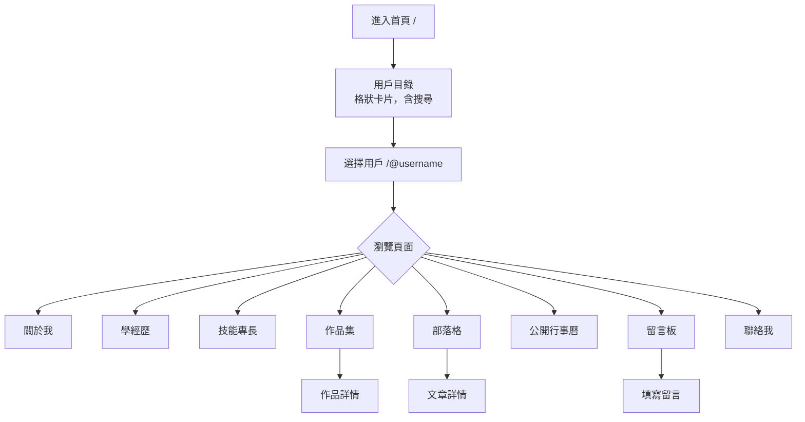
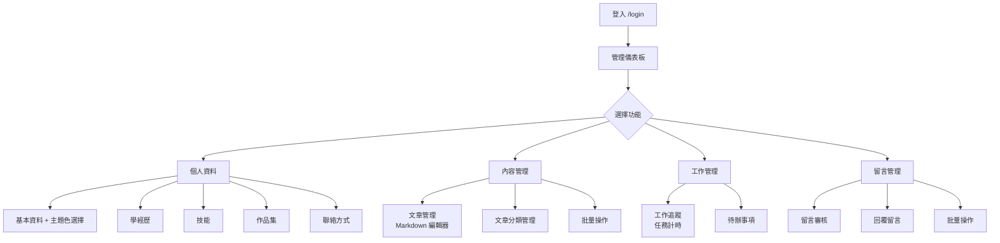

# Personal Manager 功能概覽

## 系統架構

```
┌─────────────────────────────────────────────────────────────┐
│                    Personal Manager                         │
├─────────────────────┬─────────────────────────────────────  ┤
│   公開展示區         │     管理後台                          │
├─────────────────────┼─────────────────────────────────────  ┤
│ /@:username 架構    │ /admin/* 路由（需登入）               │
│ • 用戶目錄首頁       │ • 個人資料管理                       │
│ • 關於我            │ • 學經歷管理                          │
│ • 學經歷            │ • 技能管理                            │
│ • 技能專長          │ • 作品集管理                          │
│ • 作品集            │ • 行事曆管理                          │
│ • 部落格            │ • 工作追蹤                            │
│ • 公開行事曆        │ • 待辦事項                            │
│ • 留言板            │ • 文章管理（含 Markdown 編輯器）      │
│ • 聯絡我            │ • 留言管理（審核、回覆）              │
└─────────────────────┴─────────────────────────────────────  ┘
```

---

## 公開展示功能

### 訪客瀏覽流程


```mermaid
flowchart TD
    A[進入首頁 /] --> B[用戶目錄\n格狀卡片，含搜尋]
    B --> C[選擇用戶 /@username]
    C --> D{瀏覽頁面}

    D --> E[關於我]
    D --> F[學經歷]
    D --> G[技能專長]
    D --> H[作品集]
    D --> I[部落格]
    D --> J[公開行事曆]
    D --> K[留言板]
    D --> L[聯絡我]

    H --> H1[作品詳情]
    I --> I1[文章詳情]
    K --> K1[填寫留言]
```

### 公開頁面路由

| 路徑 | 說明 |
|------|------|
| `/` | 用戶目錄（所有用戶的卡片列表） |
| `/@:username` | 個人關於我頁面 |
| `/@:username/experience` | 學歷 + 工作經歷 |
| `/@:username/skills` | 技能分類與等級 |
| `/@:username/portfolio` | 作品集列表 |
| `/@:username/portfolio/:id` | 作品詳情 |
| `/@:username/blog` | 部落格列表 |
| `/@:username/blog/:slug` | 文章詳情 |
| `/@:username/calendar` | 公開行事曆 |
| `/@:username/guestbook` | 留言板 |
| `/@:username/contact` | 聯絡我 |

---

## 管理後台功能

### 管理員操作流程


```mermaid
flowchart TD
    A[登入 /login] --> B[管理儀表板]
    B --> C{選擇功能}

    C --> D[個人資料]
    C --> E[內容管理]
    C --> F[工作管理]
    C --> G[留言管理]

    D --> D1[基本資料 + 主題色選擇]
    D --> D2[學經歷]
    D --> D3[技能]
    D --> D4[作品集]
    D --> D5[聯絡方式]

    E --> E1[文章管理\nMarkdown 編輯器]
    E --> E2[文章分類管理]
    E --> E3[批量操作]

    F --> F1[工作追蹤\n任務計時]
    F --> F2[待辦事項]

    G --> G1[留言審核]
    G --> G2[回覆留言]
    G --> G3[批量操作]
```

### 管理後台路由

| 路徑 | 說明 |
|------|------|
| `/admin/dashboard` | 儀表板（統計概覽） |
| `/admin/profile` | 個人資料 + 主題色（5 套） |
| `/admin/experience` | 學歷 + 工作經歷 CRUD |
| `/admin/skills` | 技能 CRUD |
| `/admin/projects` | 作品集 CRUD |
| `/admin/contacts` | 聯絡方式 CRUD |
| `/admin/calendar` | 行事曆管理（月/週/清單） |
| `/admin/work-tracking` | 工作追蹤（任務 + 計時 + 報告） |
| `/admin/tasks` | 待辦事項管理（清單/看板/格狀） |
| `/admin/blog` | 文章管理（含分類、批量操作） |
| `/admin/blog/editor` | Markdown 文章編輯器 |
| `/admin/comments` | 留言審核與回覆 |

---

## 資料架構

```
Users（使用者）
├── PersonalProfiles（個人資料）1:1    — 含 ThemeColor 欄位
├── Educations（學歷）1:N
├── WorkExperiences（工作經歷）1:N
├── Skills（技能）1:N
├── Portfolios（作品集）1:N
├── CalendarEvents（行事曆）1:N
├── TodoItems（待辦事項）1:N
├── WorkTasks（工作任務）1:N
├── BlogPosts（部落格文章）1:N
├── GuestBookEntries（留言）1:N        — 含 TargetUserId 欄位（每人留言板）
└── ContactMethods（聯絡方式）1:N
```

---

## 技術棧

| 端 | 技術 |
|----|------|
| 前端 | Vue 3 + TypeScript + Pinia + Axios + Tailwind CSS + Heroicons |
| 後端 | C# .NET 9.0 Web API + EF Core 9 + MariaDB |
| 部署 | Zeabur |
| 認證 | JWT Bearer Token（24 小時有效期） |
| 主題 | CSS 自訂屬性（5 套：blue/green/purple/rose/slate） |

---

## 多用戶主題系統

每位用戶可在個人資料設定中選擇主題色，公開頁面自動套用對應的 CSS 變數：

| 主題 | 說明 |
|------|------|
| blue（預設） | 天空藍 `#0ea5e9` |
| green | 翠綠 `#22c55e` |
| purple | 紫羅蘭 `#a855f7` |
| rose | 玫瑰紅 `#f43f5e` |
| slate | 石板灰 `#64748b` |
