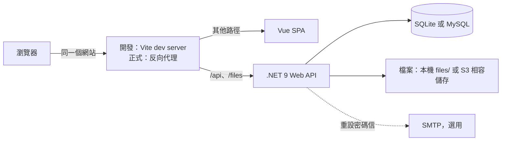

# Personal Manager — 系統規格書

> 版本：v3.0 | 最後更新：2026-10-01 | 對應 2026-09 起的全面重構

本文件說明系統的範圍、架構與設計原則。細節以其他文件與程式碼為準，避免重複：

| 主題 | 文件 |
| --- | --- |
| 本地開發、測試、常見工作 | [`development-guide.md`](development-guide.md) |
| 部署條件 | [`deployment-guide.md`](deployment-guide.md) |
| 資料表 | [`database-design.md`](database-design.md) |
| 後端寫法與設定 | [`backend/CLAUDE.md`](../backend/CLAUDE.md) |
| 前端寫法與路由 | [`frontend/CLAUDE.md`](../frontend/CLAUDE.md) |
| API 完整定義 | Swagger（`/swagger`，僅 Development）與 [`backend/openapi.json`](../backend/openapi.json) |
| 待辦與技術債 | [`TASKS.md`](TASKS.md) |
| 技術教學（設計理由與範例） | [`technical-guide.md`](technical-guide.md) |
| 測試結果 | [`test-report.md`](test-report.md) |

---

## 目錄

1. [專案概述](#1-專案概述)
2. [使用者角色](#2-使用者角色)
3. [功能範圍](#3-功能範圍)
4. [系統架構](#4-系統架構)
5. [後端架構](#5-後端架構)
6. [前端架構](#6-前端架構)
7. [資料模型](#7-資料模型)
8. [API 設計](#8-api-設計)
9. [安全設計](#9-安全設計)
10. [環境與部署](#10-環境與部署)
11. [已知限制](#11-已知限制)
12. [架構決策紀錄（ADR）](#12-架構決策紀錄adr)

---

## 1. 專案概述

**Personal Manager** 是多使用者的個人展示與管理平台。每位使用者有：

- **公開頁面** `/@username`：個人介紹、作品集、經歷與技能、文章、留言板、公開行事曆、聯絡方式
- **管理後台** `/admin`：管理上述內容，以及只有自己看得到的待辦、行事曆與工作追蹤

使用者不限於工程師。作品集依「作品集模式」（設計師、前端工程師、後端工程師）提供不同的預設呈現（ADR-012）。

### 技術棧

| 層級 | 技術 |
| --- | --- |
| 後端 | .NET 9 Web API、EF Core 9 |
| 資料庫 | SQLite（預設）；可切換 MySQL／MariaDB（Pomelo） |
| 認證 | JWT access token（15 分鐘）+ httpOnly cookie refresh token（14 天，每次輪換） |
| 前端 | Vue 3.5、TypeScript（strict）、Vue Router 4、Pinia、Axios、Tailwind CSS 3、Vite 7 |
| 文章編輯器 | Tiptap（「/」選單、圖片說明、嵌入、程式碼區塊） |
| 內容安全 | 後端 HtmlSanitizer、前端 DOMPurify |
| 測試 | xUnit + WebApplicationFactory（後端）、Vitest（前端單元）、Playwright（E2E） |

### 倉庫結構（monorepo，ADR-009）

```
personal_manager/
├── backend/            # .NET 方案：src/PersonalManager.Api、tests/PersonalManager.Tests、openapi.json
├── frontend/           # Vue SPA：src/、e2e/
├── docs/               # 本文件與其他文件
└── CHANGELOG.md
```

---

## 2. 使用者角色

| 角色 | 可以做的事 |
| --- | --- |
| 訪客（未登入） | 瀏覽使用者目錄與任何人的公開頁面；在留言板留言（需經審核才顯示） |
| 使用者（`User`） | 註冊、登入；管理自己的所有內容；只能看到與修改自己的資料 |
| 管理員（`Admin`） | 使用者的所有權限，加上檢視使用者清單、停用帳號、變更角色 |

- 第一位管理員由設定 `Admin:BootstrapEmails` 指定：以該 Email 註冊即成為管理員
- 管理員不能停用自己或移除自己的管理員角色
- 管理員**不能**編輯其他使用者的內容；使用者管理只涉及帳號狀態

---

## 3. 功能範圍

### 3.1 公開頁面

| 頁面 | 路徑 | 內容 |
| --- | --- | --- |
| 使用者目錄 | `/` | 啟用中的使用者卡片，可搜尋 |
| 個人首頁 | `/@:username` | 介紹、可接案狀態、精選作品、經歷與技能、最新文章、聯絡方式 |
| 作品列表 | `/@:username/works` | 依分類與標籤篩選；卡片版型依使用者設定 |
| 作品詳情 | `/@:username/works/:slug` | 封面輪播、作品資訊、內容區塊（圖片可開 lightbox）、上一件／下一件 |
| 文章列表 | `/@:username/blog` | 分頁、分類與標籤篩選、搜尋 |
| 文章 | `/@:username/blog/:slug` | 目錄、閱讀時間、程式碼上色、瀏覽數 |
| 留言板 | `/@:username/guestbook` | 已審核的留言與回覆、留言表單 |
| 行事曆 | `/@:username/calendar` | 公開行程（月檢視，重複行程已展開） |

公開頁面的主題色（5 種）由使用者設定；深淺色由訪客切換。舊網址（`portfolio`、`experience`、`skills`、`contact`、`about`）導向新頁面。

### 3.2 管理後台

| 分組 | 頁面 | 重點 |
| --- | --- | --- |
| 總覽 | 儀表板 | 待審留言、草稿、未完成待辦、最近 7 天工時；接下來 7 天的行程 |
| 公開內容 | 個人資料 | 基本資料、大頭照、主題色、作品集模式與卡片版型、技能呈現方式 |
| | 作品 | 區塊式編輯器，自動儲存；排序、精選、公開 |
| | 文章 | Tiptap 編輯器，自動儲存；草稿、發佈、排程、封存 |
| | 經歷 | 學歷與工作經歷，可排序 |
| | 技能 | 自由輸入分類與標籤；依作品集模式提供建議 |
| | 聯絡方式、留言 | 留言審核、回覆、刪除 |
| | 檔案 | 上傳與刪除；刪除前列出使用中的作品、文章與個人資料 |
| 個人工具 | 行事曆 | 月檢視；重複規則（每天／週／月／年）與結束日 |
| | 待辦 | 優先度、狀態、到期日；依狀態分組 |
| | 工作追蹤 | 專案、任務、計時器與時間紀錄、週報 |
| 帳號 | 帳號設定 | 變更密碼 |
| | 使用者（管理員） | 帳號狀態與角色 |

另有登入、註冊、忘記密碼、重設密碼頁面。

### 3.3 不在範圍內

- 影片上傳（只能以網址嵌入白名單網站，ADR-012）
- 設計原始檔（AI、PSD 等）上傳
- 多人共同編輯同一份內容
- 站內通知、Email 訂閱

---

## 4. 系統架構



- 前端與 API 必須屬於同一個 site，refresh cookie（`SameSite=Strict`）才會送出（ADR-010）。開發時由 Vite 轉送 `/api` 與 `/files`
- API 是無狀態的；登入狀態只存在 access token 與資料庫中的 refresh token 雜湊
- 啟動時自動套用 migration；Development 環境額外建立示範資料並開放 Swagger

---

## 5. 後端架構

### 5.1 結構

```
src/PersonalManager.Api/
├── Program.cs              # 只呼叫 Setup/ 的擴充方法
├── Setup/                  # DI、Swagger、流量限制、CORS、middleware 管線
├── Features/<名稱>/         # Controller、Service、DTO，依功能分資料夾（ADR-011）
├── Common/                 # 例外、目前使用者、分頁、排序、HTML 清洗、slug、嵌入白名單
├── Models/                 # EF Core 實體
├── Data/                   # DbContext、兩種資料庫的 context、JSON 欄位、示範資料
├── Migrations/Sqlite|MySql # 兩組 migration（ADR-008）
├── Auth/                   # JWT 設定與驗證
├── Services/               # 檔案儲存（本機／S3）、Email、健康檢查
└── Middleware/             # 例外轉換為 HTTP 回應
```

### 5.2 請求處理

1. **Controller** 只負責路由、授權屬性與 HTTP 狀態，業務邏輯交給 service
2. **Service** 直接使用 `ApplicationDbContext`，以 `ICurrentUser` 取得登入者；屬於使用者的資料一律以 `OwnedBy(userId)` 查詢，查不到就是 404，不區分「不存在」與「不是你的」
3. 回傳 DTO（`record`），不回傳實體
4. 錯誤以 `AppException` 的子類別丟出（`NotFoundException`、`DomainValidationException`、`ConflictException`、`UnauthenticatedException`）；角色不足的 403 由 `[Authorize(Roles = …)]` 產生，由 `ErrorHandlingMiddleware` 轉為對應的狀態碼

### 5.3 回應格式

所有回應以 `ApiResponse<T>` 包裝，JSON 欄位為 camelCase，enum 以字串輸出：

```json
{ "success": true, "message": "…", "data": { } }
{ "success": false, "message": "驗證失敗", "errors": ["標題不可為空"] }
```

| 狀態碼 | 情況 |
| --- | --- |
| 400 | 驗證失敗（`errors` 列出原因） |
| 401 | 未登入或 access token 過期 |
| 403 | 已登入但角色不足（僅管理員端點） |
| 404 | 資源不存在或不屬於目前使用者 |
| 409 | 衝突（例如 slug 或使用者名稱重複） |
| 429 | 超過流量限制 |

### 5.4 富文本與內容

- 文章 HTML 與作品的文字區塊在儲存時以 HtmlSanitizer 清洗（`Common/RichTextSanitizer.cs`），只保留編輯器會產生的標籤
- 嵌入網址必須是白名單網站的 https 網址（`Common/EmbedProviders.cs`，前端 `lib/embeds.ts` 使用同一份清單）
- 作品與文章的 slug 在使用者範圍內唯一；未指定時由標題產生，改標題不會改變既有 slug

### 5.5 檔案

- 儲存方式由設定決定：本機 `files/`（預設）或 S3 相容儲存
- 以檔案內容（magic bytes）判斷類型，不相信副檔名與用戶端的 Content-Type；圖片記錄寬高
- 存檔名稱為 GUID；原始檔名只用於顯示
- 單檔上限 50 MB；圖片接受 JPG、PNG、WebP、GIF，文件接受 PDF、Word、PowerPoint、Excel、ZIP

---

## 6. 前端架構

### 6.1 結構

```
src/
├── api/          # http.ts（HTTP 層）與依資源分組的 API 模組；schema.ts 由 openapi-typescript 產生
├── lib/          # 純函式：HTML 清洗、程式碼上色、嵌入、日期格式、文件轉換…（皆有單元測試）
├── composables/  # useAsyncData、useAsyncAction、useOwnedList、useAutosave、useColorScheme…
├── stores/       # auth（登入狀態）、toast（操作提示）
├── router/       # 路由與守衛（有測試）
├── views/        # public/（前台）、manage/（後台）、登入與密碼相關頁
└── components/   # public/、manage/（含作品與文章編輯器）
```

### 6.2 資料流

```
View → composable（useAsyncData／useAsyncAction／useOwnedList）→ src/api/<資源>.ts → http.ts → API
```

- 頁面資料由 composable 取得，**不**放進全域 store；store 只保存跨頁共用的登入狀態與提示訊息
- API 型別一律取自產生的 `Schemas`，不手寫 DTO；後端 API 變更時重新產生

### 6.3 HTTP 層與登入狀態

- access token 只存在記憶體；refresh token 是 httpOnly cookie，前端讀不到
- 收到 401 時以 refresh cookie 續期後重試一次；同時多個 401 共用同一次 refresh
- 只重試 GET（網路錯誤、5xx）；寫入請求不自動重送
- 重新整理頁面時先呼叫 refresh 還原登入狀態，路由守衛會等待還原完成
- 登入後只接受站內的 redirect 路徑

### 6.4 編輯器

- 作品與文章編輯器都以 `useAutosave` 自動儲存（延遲送出、離開前提醒、顯示儲存狀態）
- 編輯器內部狀態與 API 資料的轉換集中在 `lib/workDocument.ts`、`lib/postDocument.ts`，可單獨測試

### 6.5 視覺

- 設計 token 定義在 `assets/tokens.css`，對應為 Tailwind 顏色；深淺色以 `data-theme`、主題色以 `data-accent` 切換
- 前台依 prototype 設計；後台以清單 + 側邊編輯面板為主，力求簡單
- 字體：LXGW WenKai TC（標題）、Noto Sans TC（內文）、Schibsted Grotesk（英數）、JetBrains Mono（程式碼）

---

## 7. 資料模型

完整說明見 [`database-design.md`](database-design.md)。重點：

- 內容屬於使用者（`UserId`），公開與否由各筆資料的 `IsPublic`、文章的 `Status` 與 `PublishedAt`、留言的 `IsApproved` 決定
- 標籤是使用者自己的清單，文章與作品共用
- 作品的封面、資訊欄位、連結與內容區塊以 JSON 存在同一列（ADR-012）
- 時間一律以 UTC 儲存；只有日期的欄位使用 `DateOnly`
- enum 以字串儲存

---

## 8. API 設計

API 分為三組（ADR-011），完整清單見 Swagger 或 `backend/openapi.json`。

| 前綴 | 對象 | 規則 |
| --- | --- | --- |
| `/api/public/users/{username}/…` | 任何人 | 只回傳公開資料：`IsPublic`、已發佈且發佈時間已到的文章、已審核的留言；不含 Email 等私人欄位 |
| `/api/me/…` | 已登入的使用者 | 只能讀寫自己的資料 |
| `/api/admin/…` | 管理員 | 使用者清單、帳號狀態、角色 |
| `/api/auth/…` | 任何人 | 登入、註冊、refresh、登出、忘記密碼、重設密碼；`GET /me` 需登入 |

慣例：

- 清單型資源：`GET`／`POST /api/me/<資源>`，`PUT`／`DELETE /api/me/<資源>/{id}`；可排序的資源有 `PUT /api/me/<資源>/order`
- 公開的作品與文章以 slug 取得；列表支援分頁與 `facets`（分類與標籤的數量）
- 文章瀏覽數以 `POST …/posts/{slug}/views` 記錄，不在讀取時累加

---

## 9. 安全設計

### 9.1 認證

| 項目 | 設計 |
| --- | --- |
| 密碼 | BCrypt |
| access token | JWT（HS256），15 分鐘，放在 `Authorization: Bearer` |
| refresh token | 隨機值，14 天；以 httpOnly、Secure、`SameSite=Strict` cookie 傳遞，只限 `/api/auth` 路徑；資料庫只存 SHA-256 雜湊 |
| 輪換 | 每次 refresh 發新的 token 並撤銷舊的；已撤銷的 token 再被使用時，撤銷該使用者所有 refresh token |
| 登出 | 撤銷目前的 refresh token 並清除 cookie |
| 重設／變更密碼 | 重設密碼使用一次性連結（雜湊儲存、有效期限），不透露 Email 是否存在；重設或變更密碼後撤銷所有 refresh token |
| 停用帳號 | 無法登入，refresh 失敗 |

### 9.2 授權

- `/api/me` 與 `/api/admin` 需登入；`/api/admin` 另需 `Admin` 角色
- 資料所有權在 service 以 `OwnedBy(userId)` 限制，不依賴用戶端傳入的 `userId`
- 引用檔案時只接受自己上傳的檔案，網址、尺寸等資訊由伺服器填入

### 9.3 設定與機密

- `appsettings.json` 只有占位符；JWT 金鑰未設定或太短時後端拒絕啟動
- 示範資料、Swagger 與 localhost CORS 只在 Development 環境啟用

### 9.4 輸入與輸出

- 富文本在後端儲存時清洗，前端顯示時（`v-html`）再經 DOMPurify；程式碼上色的輸出已跳脫所有文字
- 嵌入只接受白名單網站；檔案以內容判斷類型

### 9.5 流量限制（依 IP，每分鐘）

| 規則 | 端點 | 預設 |
| --- | --- | --- |
| `auth` | 登入、註冊、忘記密碼、重設密碼、變更密碼 | 10 次 |
| `session` | refresh、登出 | 60 次（多開分頁時每頁都會 refresh） |
| `public_write` | 留言、文章瀏覽數 | 10 次 |

超過時回傳 429，數值可由 `RateLimiting:*PermitsPerMinute` 調整。

---

## 10. 環境與部署

目前**沒有正式環境**，只在本機開發（Zeabur 已停用，也不使用 Docker）。

| 環境 | 用途 | 資料庫 |
| --- | --- | --- |
| Development | 本機開發 | SQLite（`App_Data/`），首次啟動建立示範資料 |
| 測試 | 後端整合測試、E2E | 每次使用新的暫存 SQLite |
| Production | 尚未部署 | 依設定使用 SQLite 或 MySQL |

- 本機啟動見 [`development-guide.md`](development-guide.md)
- 日後部署的必要條件（同一個網站、HTTPS、環境變數、資料與檔案持久化）見 [`deployment-guide.md`](deployment-guide.md)
- 沒有 CI：提交前在本機執行測試與檢查（清單見 [`development-guide.md`](development-guide.md#測試與檢查)）

---

## 11. 已知限制

| 限制 | 影響 | 說明 |
| --- | --- | --- |
| 作品內容以 JSON 儲存 | 無法在資料庫中查詢區塊內容 | 目前沒有這個需求（ADR-012） |
| 檔案引用沒有外鍵 | 刪除檔案後，引用它的內容會失效 | 刪除前以 usages API 提示使用中的內容 |
| SQLite 換到 MySQL 不搬移資料 | 需自行匯出匯入 | 兩組 migration 只保證 schema 相同 |
| 本機檔案儲存 | 多台主機或無狀態平台無法共用 | 改用 S3 相容儲存 |
| 未設定 SMTP 時 | 重設密碼信只寫入 log | 本機開發可從 log 取得連結 |
| 流量限制存在記憶體 | 多台主機時各自計算 | 目前只有單一主機 |

進行中的工作與新發現的技術債記錄在 [`TASKS.md`](TASKS.md)。

---

## 12. 架構決策紀錄（ADR）

### ADR-001：資料庫 JSON Fallback
**決策**：後端啟動時自動偵測 DB 連線，失敗自動 fallback 至本地 JSON
**原因**：簡化本地開發環境建立，開發者不需安裝 MariaDB
**取捨**：JSON 實作不支援複雜查詢，功能有限

### ADR-002：`/@:username` URL 架構
**決策**：個人頁面採用類 GitHub 的 `/@:username` 路由格式
**原因**：直覺、易記，不與其他路由衝突（`@` 前綴區隔）
**取捨**：URL 含特殊字元，部分環境可能需要特殊處理

### ADR-003：三倉庫策略
**決策**：主專案、後端、前端各用獨立 Git 倉庫
**原因**：各服務可獨立部署與版本控制，符合微服務精神
**取捨**：本地開發需 clone 三個倉庫，協調成本略高

### ADR-004：JWT 24h 有效期（無 Refresh Token）
**決策**：JWT 有效期 24 小時，過期後強制重新登入
**原因**：簡化實作，個人管理工具使用頻率已足夠
**取捨**：長時間工作可能被強制中斷，日後可加入 Refresh Token

### ADR-005：TipTap WYSIWYG 取代純 Markdown
**決策**：部落格編輯器採用 TipTap，移除 Markdown 模式
**原因**：所見即所得，降低寫作門檻；支援圖片拖放
**取捨**：內容儲存為 HTML，Markdown 用戶可能不習慣

### ADR-006：主題系統使用 CSS 變數
**決策**：5 套主題透過 CSS 變數動態切換，而非多套 CSS 類別
**原因**：與 TailwindCSS 整合簡單，UserLayout 一個 `:style` 綁定即可套用
**取捨**：主題選項固定為 5 種，擴充需修改 composable

### ADR-007：Repository + Service 雙層架構
**決策**：明確區分 Repository（資料存取）與 Service（業務邏輯）層
**原因**：支援 EF/JSON 雙 Repository 實作切換；業務邏輯測試不依賴 DB
**取捨**：對簡單 CRUD 操作略為冗餘，增加檔案數量

> **2026-09 重構說明**：ADR-001、003、004、007 已被下列 ADR 取代。

### ADR-008：移除 JSON fallback，改用 SQLite（取代 ADR-001）
**決策**：資料庫 provider 由設定檔決定（`Sqlite` 預設 / `MySql`），本地與暫時的執行環境一律使用 SQLite；保留 Pomelo 套件以便日後切換到 MySQL/MariaDB。兩種 provider 各有一組 migration
**原因**：JSON 模式在 Linux 上檔名對不到、不支援 Tag 關聯、沒有寫入鎖，且迫使 repository 介面接收 `Func<T,bool>`，導致每次查詢都把整張表讀進記憶體；DB 斷線時還會無聲改用 JSON 啟動。目前沒有雲端環境，也不使用 Docker
**取捨**：每次 schema 異動需產生兩組 migration；SQLite 與 MySQL 的型別與排序規則有差異，需以測試覆蓋

### ADR-009：Monorepo（取代 ADR-003）
**決策**：前後端合併至主 repo 的 `backend/`、`frontend/`，以 `git subtree` 保留歷史
**原因**：一個功能原本要在三個 repo 各 commit 一次且互不引用；規則文件重複三份；主 repo 只有文件，而文件過時最快
**取捨**：CI 需依路徑區分；未來部署平台需設定各自的 root directory

### ADR-010：Refresh token 改用 httpOnly cookie（取代 ADR-004）
**決策**：refresh token 以 httpOnly + Secure + SameSite cookie 傳遞並以雜湊值儲存；access token 只放在前端記憶體
**原因**：token 放 localStorage 時，任何 XSS 都能竊取 refresh token
**取捨**：後端 CORS 需允許 credentials；重新整理頁面時需先呼叫 refresh 取得 access token

### ADR-011：API 分為 public / me / admin，移除泛型 Repository（取代 ADR-007）
**決策**：
- `/api/public/...` 只回傳公開資料（已發佈、IsPublic、已審核，且不含 Email 等私人欄位）
- `/api/me/...` 只能操作目前登入者自己的資料
- `/api/admin/...` 限 Admin 角色
- 移除 `IRepository<T>` 與 `CrudService`，feature service 直接使用 EF Core `DbContext`
- 程式碼改為 feature folder，整合測試使用 SQLite in-memory
**原因**：原本公開與私人資料混在同一組端點，每個端點各自把關，已造成草稿、非公開資料與訪客 Email 外洩；泛型 repository 是為了 JSON 模式而存在，移除 JSON 後只剩阻礙（無法在 DB 端篩選、分頁、投影）
**取捨**：前端呼叫的 API 全部改變（前端同步重寫）；服務層測試改依賴 SQLite，而非 mock

### ADR-012：作品集改為區塊式內容，以「作品集模式」適用各種職業
**決策**：
- 作品組成：標題、一句話簡介、分類、標籤、封面輪播（依序排列的多張圖，第 1 張為主圖，可設定裁切重點）、作品資訊欄位、連結、依序排列的內容區塊
- **作品集模式**（使用者在後台選擇）：設計師、前端工程師、後端工程師。模式決定預設的卡片版型、建議的作品資訊欄位與技能建議清單；所有區塊類型在每種模式都可使用
- **卡片版型**由使用者自行選擇，不受模式限制：
  - 圖像型：可選直式、方形、橫式
  - 資訊型：橫式卡片，附簡介與標籤
  - 技術型：以文字與重點數字為主，截圖為選用縮圖
  - 沒有任何圖片時，以標題與分類產生文字封面
- 作品資訊欄位只固定「角色」「期間」，其餘由使用者自訂名稱與內容
- 區塊類型：
  - 文字
  - 單張圖片：同文字寬、寬版、滿版出血
  - 圖庫：原比例（不裁切）、兩欄、三欄、上下堆疊
  - 附件
  - 嵌入
  - 重點數字：數值加說明，例如「−62% P95 延遲」
  - 程式碼：語言、程式碼、說明，附語法上色
- 每張圖片都有說明與替代文字
- 圖片接受 JPG、PNG、WebP、GIF
- **影片不提供上傳**，只能以網址嵌入，由使用者自行放到 YouTube、Vimeo 等平台
- **嵌入只接受白名單網站的 https 網址**：YouTube、Vimeo、Figma、Sketchfab、SoundCloud、Google Slides、CodePen、GitHub Gist
- 附件單檔上限 50 MB，只接受輸出檔（PDF、Word、PowerPoint、Excel、ZIP），不接受 AI、PSD 等原始檔；PDF 可線上預覽
- 卡片封面多張時自動輪播：滑鼠停留或鍵盤聚焦時暫停、可點圓點切換、手機可滑動，系統設定「減少動態」時不自動播放
**原因**：原模型只有一個手動貼網址的 `ImageUrl`，附件另外管理且沒有說明欄位。平台使用者不限於工程師：
- 設計類職業需要以圖像為主、不裁切的呈現，以及文件附件
- 動態、3D、UI 設計需要嵌入影片與原型
- 後端工程師的成果多半不是畫面，而是架構、程式碼與數據
**取捨**：
- 後台需要區塊編輯器
- 自訂欄位以有序的名稱／內容清單儲存，無法跨作品做結構化查詢（目前沒有這個需求）
- 影片不上傳，節省儲存空間，但依賴外部平台
- 舊的 `ImageUrl`、連結欄位與 `PortfolioAttachment` 不轉換（尚未上線，沒有需要保留的資料）；既有作品只保留標題，描述移到摘要，網址代稱為 `work-{Id}`

**實作補充**（Phase 3）：
- 封面、作品資訊欄位、連結、內容區塊以 JSON 文字存在作品資料列中（`Data/JsonColumns.cs`），整份作品一起讀寫；使用一般字串欄位，SQLite 與 MySQL 都適用
- 區塊以 `type` 區分類型（`text`、`image`、`gallery`、`files`、`embed`、`metrics`、`code`），未知類型回 400
- 用戶端只送 `fileId`（或外部 https 圖片網址），檔案網址、寬高、檔名、類型、大小由伺服器依使用者自己上傳的檔案填入；引用別人的檔案或把文件當圖片使用都回 400
- 數量上限：區塊 100、封面 10、欄位 20、連結 10、圖庫 50 張、附件 20 個、重點數字 8 個
- 公開列表回傳卡片（封面、裁切重點、第一個重點數字區塊），不含內容區塊；單件作品以使用者範圍內唯一的 slug 取得，未指定 slug 時沿用原本的，改標題不會讓連結失效

---

*文件維護：架構異動時更新對應章節；做了新的架構決策時在第 12 章新增 ADR，並記錄於根目錄 `CHANGELOG.md`。*
