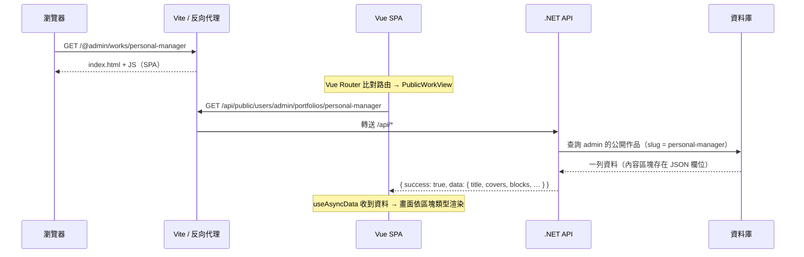
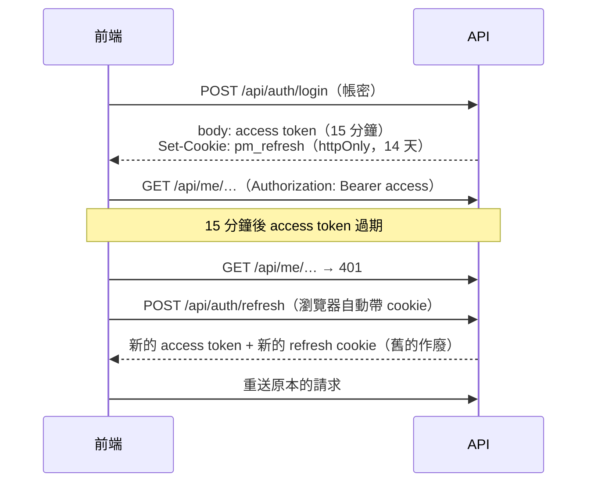

# 技術教學：Personal Manager 是怎麼做出來的

這份文件以本專案為例，說明一個全端網站用了哪些技術、程式碼怎麼組織，以及**為什麼**這樣設計。
讀完後，你應該能看懂任何一段程式碼在整體中的位置，也能照著最後一章自己加一個新功能。

> 適合對象：寫過一點 C# 或 TypeScript，想了解「一個完整的網站專案長什麼樣子」的人。
> 架構決策的正式紀錄在 [`system-specification.md`](system-specification.md) §12（ADR），本文會在相關段落標註 ADR 編號。

## 目錄

1. [全貌：一個請求的旅程](#1-全貌一個請求的旅程)
2. [技術選擇與原因](#2-技術選擇與原因)
3. [後端](#3-後端)
4. [前端](#4-前端)
5. [前後端之間的約定](#5-前後端之間的約定)
6. [測試策略](#6-測試策略)
7. [實作練習：新增一個功能](#7-實作練習新增一個功能)
8. [設計原則總結](#8-設計原則總結)

---

## 1. 全貌：一個請求的旅程

以「訪客打開 `/@admin/works/personal-manager`（作品詳情頁）」為例：



幾個值得注意的地方：

- **前端與 API 是同一個網站**：瀏覽器只跟一個網址說話，`/api` 由 Vite（開發）或反向代理（正式）轉給後端。這是登入機制能運作的前提（見 [3.4](#34-認證兩種-token-各司其職)）
- **公開資料走 `/api/public/...`**，不需要登入；後端只回傳「設為公開」的內容
- **後端回傳的是 DTO，不是資料庫實體**：前端拿到的欄位是刻意挑選過的

---

## 2. 技術選擇與原因

| 技術 | 用途 | 為什麼選它 |
| --- | --- | --- |
| **.NET 9 Web API** | 後端 | 型別安全、效能好；內建 DI、驗證、流量限制、OpenAPI，不必拼湊套件 |
| **EF Core 9** | ORM | 以 LINQ 寫查詢，編譯期就能發現欄位錯誤；migration 管理 schema 版本 |
| **SQLite**（預設） | 資料庫 | 零安裝，clone 下來就能跑；測試可以每次開一個新檔案（ADR-008） |
| **MySQL / MariaDB**（可切換） | 資料庫 | 正式環境多人同時寫入時使用；只要改設定 |
| **JWT + httpOnly cookie** | 認證 | access token 無狀態、驗證快；refresh token 放 cookie，JavaScript 讀不到，XSS 偷不走（ADR-010） |
| **Vue 3 + `<script setup>`** | 前端框架 | 語法直覺，Composition API 讓邏輯可以抽成 composable 重複使用 |
| **TypeScript（strict）** | 前端語言 | 搭配從後端產生的型別，API 欄位改名時編譯就會失敗，而不是上線才壞 |
| **Pinia** | 全域狀態 | 只用在真正跨頁共用的狀態（登入、提示訊息）；頁面資料不放全域 |
| **Tailwind CSS** | 樣式 | 搭配設計 token，顏色與間距有一致的來源；不需要為每個元件想 class 名稱 |
| **Tiptap** | 文章編輯器 | 以 ProseMirror 為核心，可以寫自訂節點（圖片說明、嵌入、「/」選單） |
| **DOMPurify / HtmlSanitizer** | HTML 清洗 | 富文本是 XSS 的主要入口，前後端各清一次 |
| **openapi-typescript** | 型別產生 | 由後端的 OpenAPI 文件產生前端型別，前後端只有一份真相 |
| **xUnit + WebApplicationFactory** | 後端測試 | 在記憶體裡啟動真正的 API，以 HTTP 測試，涵蓋路由、授權、序列化 |
| **Vitest** | 前端單元測試 | 與 Vite 共用設定，速度快 |
| **Playwright** | E2E | 用真的瀏覽器跑真的後端，驗證關鍵流程 |

**刻意不用的東西**也是設計的一部分：

| 沒有用 | 原因 |
| --- | --- |
| 泛型 Repository（`IRepository<T>`） | EF Core 的 `DbContext` 本身就是 Unit of Work + Repository，再包一層只會遮住 LINQ 的能力（ADR-011） |
| AutoMapper | DTO 轉換寫成一個 `ToDto` 方法，比設定對應規則更容易追蹤 |
| 把所有資料放進 Pinia | 頁面資料放全域會帶來「何時重新載入」「哪份是最新」的問題；改由頁面自己的 composable 管理 |
| Docker | 目前只在本機開發，SQLite 已經做到零安裝 |

---

## 3. 後端

### 3.1 程式碼組織：依功能分資料夾

```
src/PersonalManager.Api/
├── Features/
│   ├── Skills/
│   │   ├── SkillControllers.cs   # 公開與後台兩個 controller
│   │   ├── SkillDtos.cs          # 請求與回應的 record
│   │   └── SkillService.cs       # 業務邏輯
│   ├── Portfolios/ Blog/ Auth/ …
├── Common/      # 跨功能共用：例外、目前使用者、排序、分頁、HTML 清洗
├── Services/    # 基礎設施：寄信、檔案儲存（本機／S3）、健康檢查
├── DTOs/        # 所有 API 共用的回應格式 ApiResponse、PagedResult
├── Models/      # EF Core 實體
└── Data/        # DbContext、migration 設定
```

**為什麼功能程式不放進 `Controllers/`、`Services/`、`DTOs/` 這種依技術角色分的資料夾？**
改一個功能時，需要的檔案都在同一個資料夾裡；刪掉一個功能，就是刪掉一個資料夾。
依「技術角色」分資料夾時，一個功能散落在三、四個地方，專案變大後很難看出哪些檔案彼此相關（ADR-011）。

`Services/` 與 `DTOs/` 仍然存在，但只放**不屬於任何功能**的東西：寄信、檔案儲存這類基礎設施，以及每個 API 共用的回應外層。
功能自己的 service 與 DTO 一律放在 `Features/<名稱>/`。

### 3.2 一個 feature 的寫法

以技能（`Features/Skills/SkillService.cs`）為例，所有清單型功能都長這樣：

```csharp
public sealed class SkillService(ApplicationDbContext db, ICurrentUser currentUser)
{
    // 公開頁面：先確認使用者存在且啟用，再只取公開的資料
    public async Task<List<PublicSkillDto>> GetPublicAsync(string username)
    {
        var userId = await db.RequirePublicUserIdAsync(username);
        return await db.Skills.AsNoTracking()
            .OwnedBy(userId)
            .Where(s => s.IsPublic)
            .OrderBy(s => s.SortOrder).ThenBy(s => s.Id)
            .Select(s => new PublicSkillDto(s.Id, s.Name, s.Category, s.Level, s.YearsOfExperience))
            .ToListAsync();
    }

    // 後台：只能操作自己的資料
    public async Task<SkillDto> UpdateAsync(int id, SaveSkillRequest request)
    {
        var skill = await FindMineAsync(id);   // 不是自己的 → 404
        Apply(skill, request);
        skill.UpdatedAt = DateTime.UtcNow;
        await db.SaveChangesAsync();
        return ToDto(skill);
    }

    private async Task<Skill> FindMineAsync(int id) =>
        await db.Skills.OwnedBy(currentUser.RequireUserId()).FirstOrDefaultAsync(s => s.Id == id)
        ?? throw new NotFoundException("找不到這項技能");
}
```

重點：

| 寫法 | 原因 |
| --- | --- |
| Service 直接用 `DbContext` | 篩選、排序、分頁、投影都在資料庫完成，不會把整張表讀進記憶體 |
| 讀取加 `AsNoTracking()` | 只讀的查詢不需要變更追蹤，較省記憶體 |
| `Select` 投影成 DTO | 只查需要的欄位，也避免不小心把 `PasswordHash` 之類的欄位回傳出去 |
| 公開與後台分成 `PublicSkillDto`、`SkillDto` | 公開版本不含 `IsPublic`、`SortOrder` 等管理用欄位 |
| 主要建構子（`SkillService(...)`）注入 | C# 12 語法，省去欄位宣告 |

### 3.3 資料所有權：查不到就是 404

這是多使用者系統最容易出錯的地方。重構前，曾經有「任何登入者都能修改別人的資料」「公開 API 回傳草稿」的問題。
現在的做法是把規則放進**查詢本身**，而不是寫在每個 if 裡：

```csharp
public static IQueryable<T> OwnedBy<T>(this IQueryable<T> query, int userId) where T : IOwnedByUser =>
    query.Where(e => e.UserId == userId);
```

- 屬於使用者的實體都實作 `IOwnedByUser`，後台查詢一律從 `.OwnedBy(currentUser.RequireUserId())` 開始
- `userId` 來自 JWT，**從不**採信用戶端送來的 `userId`
- 存取別人的資料時回 **404 而不是 403**：403 等於告訴對方「這個 ID 存在」，404 不透露任何資訊

API 路由也依此分成三組（ADR-011），一看網址就知道規則：

| 前綴 | 誰可以用 | 規則 |
| --- | --- | --- |
| `/api/public/users/{username}/…` | 任何人 | 只回傳公開資料 |
| `/api/me/…` | 登入者 | 只能讀寫自己的資料 |
| `/api/admin/…` | 管理員 | 帳號管理 |

### 3.4 認證：兩種 token 各司其職



| | access token | refresh token |
| --- | --- | --- |
| 形式 | JWT（簽章，伺服器不存） | 隨機字串（資料庫只存 SHA-256 雜湊） |
| 存放 | 前端記憶體（變數） | httpOnly、Secure、`SameSite=Strict` cookie，只送往 `/api/auth` |
| 壽命 | 15 分鐘 | 14 天，每次使用就換新 |
| 被偷時 | 最多 15 分鐘 | JavaScript 讀不到；若被重複使用會觸發全部登出 |

**為什麼不把 token 放 localStorage？** 任何一段 XSS 都能讀 localStorage。cookie 設為 httpOnly 後，JavaScript 完全碰不到它。

**輪換與重用偵測**（`Features/Auth/AuthService.cs`）：

```csharp
public async Task<AuthSession> RefreshAsync(string? rawToken)
{
    var hash = OpaqueTokens.Hash(rawToken);
    var stored = await db.RefreshTokens.FirstOrDefaultAsync(t => t.TokenHash == hash)
                 ?? throw new UnauthenticatedException(SessionExpired);

    if (stored.IsRevoked)
    {
        // 已作廢的 token 又出現 → 可能被偷了，撤銷這個人所有的工作階段
        await RevokeAllSessionsAsync(stored.UserId);
        throw new UnauthenticatedException(SessionExpired);
    }

    var user = await db.Users.FirstAsync(u => u.Id == stored.UserId);
    if (stored.ExpiresAt <= Now || !user.IsActive)   // 過期或帳號已停用
        throw new UnauthenticatedException(SessionExpired);

    stored.IsRevoked = true;            // 舊的立刻作廢
    return await StartSessionAsync(user); // 發一組新的
}
```

正常使用者每個 refresh token 只會用一次；同一個 token 出現兩次，表示有兩個人拿著它。

**代價**：cookie 只在同一個網站才會送出，所以前端與 API 必須部署在同一個 site（見 [`deployment-guide.md`](deployment-guide.md)）。

### 3.5 錯誤處理：丟例外，由一個地方翻譯

Service 不回傳 `null` 或錯誤碼，而是丟出有意義的例外：

```csharp
throw new NotFoundException("找不到這項技能");          // → 404
throw new ConflictException("這個網址已被使用");          // → 409
throw new DomainValidationException("結束時間必須晚於開始時間"); // → 400
```

`Middleware/ErrorHandlingMiddleware.cs` 統一把它們轉成 HTTP 回應：

```csharp
catch (AppException ex)
{
    await WriteError(context, ex.StatusCode, ApiResponse.Fail(ex.Message, errors));
}
catch (Exception ex)
{
    // 未預期的錯誤：細節只寫 log，使用者只看到通用訊息
    logger.LogError(ex, "處理 {Method} {Path} 時發生未預期的錯誤", …);
    await WriteError(context, 500, ApiResponse.Fail("系統發生錯誤，請稍後再試"));
}
```

好處：controller 與 service 裡沒有一堆 `if (x == null) return NotFound()`；SQL 錯誤、檔案路徑等內部資訊不會外洩。

輸入驗證則交給 DataAnnotations，`[ApiController]` 會在進入 action 前自動回 400：

```csharp
public sealed record SaveSkillRequest(
    [Required(ErrorMessage = "請輸入技能名稱"), StringLength(100)] string Name, …);
```

所有回應都包成同一個格式，前端只需要一種解析方式：

```json
{ "success": false, "message": "驗證失敗", "errors": ["請輸入技能名稱"] }
```

### 3.6 資料庫：一份模型、兩組 migration

- 模型全部定義在 `ApplicationDbContext`；`SqliteApplicationDbContext` 與 `MySqlApplicationDbContext` 兩個子類別只負責區分 migration 目錄
- 設定 `Database:Provider` 決定用哪一個，啟動時自動套用 migration
- 為什麼不只用一組？SQLite 與 MySQL 產生的 SQL 型別不同，同一組 migration 無法在兩邊都正確執行（ADR-008）

**慣例**：

| 慣例 | 原因 |
| --- | --- |
| `DateTime` 一律 UTC | 伺服器在哪個時區都不影響資料；前端顯示時再轉成使用者的時區 |
| 只有日期的欄位用 `DateOnly` | 生日、到期日不該因時區差一天 |
| enum 以字串儲存 | 資料庫裡看得懂；調整 enum 順序不會讓舊資料變成別的值 |
| 索引寫在 `HasIndex` | 例如 `(UserId, Slug)` 唯一，保證網址不重複 |

**產生 migration 後一定要看內容**：EF 有時會把「刪一個欄位、加一個同型別欄位」誤判成改名，直接沿用舊資料。
會轉換既有資料的 migration，都有對應的 `DataMigrationTests`：先遷移到前一版、寫入舊資料、再遷移到最新版，確認資料正確。

### 3.7 作品集：JSON 欄位 + 多型區塊

作品內容由多種區塊組成（文字、圖片、圖庫、附件、嵌入、重點數字、程式碼），且順序由使用者決定（ADR-012）。

**方案比較**：

| 方案 | 優點 | 缺點 |
| --- | --- | --- |
| 每種區塊一張資料表 | 可以用 SQL 查區塊內容 | 7 張表、讀一件作品要 join 很多次、排序難維護 |
| **整份內容存成 JSON 欄位** ✅ | 一次讀寫整件作品；新增區塊類型不用改 schema | 無法用 SQL 查區塊內容（目前沒有這個需求） |

區塊是 C# 的多型 record，序列化時以 `type` 欄位區分：

```csharp
[JsonPolymorphic(TypeDiscriminatorPropertyName = "type")]
[JsonDerivedType(typeof(TextBlock), "text")]
[JsonDerivedType(typeof(ImageBlock), "image")]
[JsonDerivedType(typeof(GalleryBlock), "gallery")]
// … files、embed、metrics、code
public abstract record PortfolioBlock;

public sealed record TextBlock(string Title, string Html) : PortfolioBlock;
public sealed record GalleryBlock(string Layout, IReadOnlyList<PortfolioImage> Items) : PortfolioBlock;
```

存進資料庫時用 `Data/JsonColumns.cs` 的 `HasJsonConversion()` 轉成字串。要注意的細節是 **`ValueComparer`**：
EF 預設只比較清單的參考，清單裡的內容改了它看不出來，就不會存檔。所以這裡以序列化結果比較內容。

**不採信用戶端的檔案資訊**：前端只送 `fileId`，圖片網址、寬高、檔名由伺服器依「這個使用者自己上傳的檔案」填入（`PortfolioContentResolver`）。
這樣使用者無法引用別人的檔案，也無法把 PDF 偽裝成圖片。

### 3.8 內容安全

| 威脅 | 防護 |
| --- | --- |
| 富文本裡藏 `<script>` | 後端存檔前以 HtmlSanitizer 清洗，只保留編輯器會產生的標籤；前端顯示前再用 DOMPurify 清一次 |
| 嵌入惡意網站 | 嵌入只接受白名單網站（YouTube、Vimeo、Figma…）的 https 網址；前後端用同一份清單 |
| 上傳偽裝的檔案 | 以檔案開頭的 magic bytes 判斷真實類型，不相信副檔名與 `Content-Type` |
| 暴力破解密碼 | 登入每個 IP 每分鐘 10 次 |
| 洗版留言 | 留言每個 IP 每分鐘 10 次，且需審核才公開 |

流量限制用 .NET 內建的 `AddRateLimiter`，依用途分三個規則。其中 refresh 刻意獨立：
使用者每開一個分頁就會 refresh 一次，若和登入共用「每分鐘 10 次」，開多個分頁就會被登出。

---

## 4. 前端

### 4.1 程式碼組織

```
src/
├── api/          # 和後端溝通：http.ts + 依資源分組的模組；schema.ts 由 OpenAPI 產生
├── lib/          # 純函式（沒有 Vue），全部有單元測試
├── composables/  # 可重複使用的 Vue 邏輯
├── stores/       # Pinia：只有 auth、toast
├── router/       # 路由與守衛
├── views/        # 頁面：public/（前台）、manage/（後台）
└── components/   # 元件：public/、manage/
```

**分層原則**：越下層越單純、越容易測試。

```
views（頁面）→ composables（狀態與流程）→ api（HTTP）
                     ↘ lib（純函式：格式化、轉換、清洗）
```

例如「把 API 回傳的作品轉成編輯器狀態」寫在 `lib/workDocument.ts`，是純函式，不需要啟動 Vue 就能測。

### 4.2 HTTP 層：自動續期、只重試安全的請求

`src/api/http.ts` 是前端唯一直接使用 Axios 的地方，負責四件事：

1. **帶上 access token**：從 auth store 取得，放進 `Authorization` header
2. **401 時自動 refresh 並重送**：使用者不會因為 token 過期而被打斷
3. **網路錯誤或 5xx 時重試 GET**：寫入請求不重試，因為伺服器可能已經處理過，重送會產生重複資料
4. **把錯誤統一成 `ApiError`**：頁面只需要處理一種錯誤

其中最巧妙的是「多個請求同時 401」的處理：

```ts
let pendingRefresh: Promise<string> | null = null

/** 同時失敗的多個請求共用同一次 refresh，refresh token 輪換後舊的就不能再用。 */
async function refreshOnce(hooks: AuthHooks): Promise<string> {
  pendingRefresh ??= hooks.refreshAccessToken().finally(() => (pendingRefresh = null))
  try {
    return await pendingRefresh
  } catch {
    hooks.onSessionExpired()
    throw new ApiError('登入已過期，請重新登入', 401)
  }
}
```

一個頁面可能同時發出 3 個請求、同時收到 3 個 401。如果各自 refresh，第一個成功後 refresh token 就輪換了，
後兩個會拿著已作廢的 token 去 refresh——觸發重用偵測，把使用者全部登出。
`??=` 讓第一個請求建立 refresh 的 Promise，其他請求等同一個 Promise。

### 4.3 Composable：把重複的流程抽出來

每個頁面都要處理「載入中 / 載入失敗 / 找不到 / 顯示資料」。`useAsyncData` 把這件事寫一次：

```ts
export function useAsyncData<T>(load: () => Promise<T>, options: Options = {}) {
  const data = shallowRef<T | null>(null)
  const loading = ref(true)
  const error = ref<string | null>(null)
  const notFound = ref(false)
  let latest = 0

  async function reload() {
    const request = ++latest
    loading.value = true
    try {
      const result = await load()
      if (request === latest) data.value = result   // 只採用最後一次請求的結果
    } catch (e) {
      if (request !== latest) return
      if (e instanceof ApiError && e.status === 404) notFound.value = true
      else error.value = e instanceof Error ? e.message : '載入失敗，請稍後再試'
    } finally {
      if (request === latest) loading.value = false
    }
  }

  if (options.watch?.length) watch(options.watch, reload)
  void reload()
  return { data, loading, error, notFound, reload }
}
```

`latest` 計數器解決了一個常見的 bug：快速從作品 A 切到作品 B，如果 A 的回應比較慢、比 B 晚到，畫面會顯示 A 的內容。

使用時，頁面只剩下「要載入什麼」：

```ts
// views/public/PublicWorkView.vue
const slug = computed(() => String(route.params.slug))

const { data, loading, error, notFound, reload } = useAsyncData(
  async () => {
    const [work, cards] = await Promise.all([
      publicApi.portfolio(username.value, slug.value),
      publicApi.portfolios(username.value),
    ])
    return { work, neighbours: neighboursOf(cards, work.slug) }   // 上一件／下一件
  },
  { watch: [username, slug] },
)
```

其他 composable：

| Composable | 負責 |
| --- | --- |
| `useAsyncAction` | 寫入操作：防止重複送出、成功與失敗都顯示提示 |
| `useOwnedList` | 後台清單頁：載入、新增、更新、刪除、拖曳排序 |
| `useAutosave` | 作品與文章的自動儲存 |
| `useColorScheme`、`useAccent` | 深淺色、主題色 |

### 4.4 自動儲存

作品與文章編輯器沒有「儲存」按鈕。`useAutosave` 的規則：

- 編輯停頓 1.2 秒後，送出整份內容
- **同一時間只有一個儲存請求**：儲存途中又有修改，等這次完成後再以最新內容存一次（避免舊內容晚到、覆蓋新內容）
- 以「上次成功儲存的內容」比對，判斷有沒有未儲存的修改；離開頁面前若有，提醒使用者
- 畫面顯示「儲存中 / 已儲存 / 儲存失敗」

編輯器的內部狀態和 API 格式不同（例如編輯器需要每個區塊有本地 id 以便拖曳排序），
轉換寫在 `lib/workDocument.ts`、`lib/postDocument.ts` 的 `toEditable()` 與 `toRequest()`。

### 4.5 文章編輯器：擴充 Tiptap

Tiptap 提供基本的段落、標題、清單；本專案自己寫了三個擴充（`components/manage/blog/extensions/`）：

| 擴充 | 做什麼 |
| --- | --- |
| `Figure` | 圖片 + 說明文字，輸出 `<figure><figcaption>` |
| `Embed` | 貼上 YouTube 等網址變成嵌入區塊，只接受白名單網站 |
| `SlashCommand` | 在空白行輸入 `/` 開啟插入選單（以 `@tiptap/suggestion` 實作） |

程式碼區塊使用 lowlight 語法上色。輸出的 HTML 會經過後端清洗，所以擴充產生的標籤都要在後端的白名單裡。

### 4.6 視覺：設計 token

所有顏色都定義成 CSS 變數（`src/assets/tokens.css`），再對應成 Tailwind 的顏色名稱：

```css
:root {
  --paper: 245 246 248;          /* 頁面背景（RGB 數值，Tailwind 才能加透明度） */
  --ink: 21 23 28;               /* 主要文字 */
  --accent-l: 39 84 197;         /* 主題色：淺色模式用 */
  --accent-d: 138 171 255;       /* 主題色：深色模式用（較亮，在深底上才看得清楚） */
  --accent: var(--accent-l);
}
:root[data-accent='green'] { --accent-l: 29 117 80; --accent-d: 114 211 165; }

/* 沒有手動選擇時跟隨系統；使用者選了深色時也套用 */
@media (prefers-color-scheme: dark) {
  :root:not([data-theme='light']) { --paper: 15 17 21; --ink: 236 238 242; --accent: var(--accent-d); }
}
:root[data-theme='dark'] { --paper: 15 17 21; --ink: 236 238 242; --accent: var(--accent-d); }
```

```html
<div class="bg-paper text-ink border-rule">…</div>
<span class="bg-accent/10 text-accent">標籤</span>
```

- 元件只寫 `bg-paper`、`text-ink` 這類**語意名稱**，不寫 `bg-white`、`text-gray-900`，深色模式就不必每個元件各寫一次
- 深淺色：預設跟隨系統，使用者手動選擇時在 `<html>` 設定 `data-theme`；主題色（5 種）只改 `data-accent`，每種主題色各有淺色與深色模式的版本
- `index.html` 有一小段預載腳本，在 Vue 啟動前就套用使用者的深淺色設定，避免畫面先白後黑的閃爍

### 4.7 路由與登入守衛

```ts
{ path: '/admin', component: AdminShell, meta: { requiresAuth: true }, children: [ … ] }
```

- App 啟動時呼叫 `restoreSession()`：以 refresh cookie 換 access token，還原登入狀態
- 路由守衛**等待還原完成**再判斷，否則重新整理後台頁面時，會在還原前被誤導向登入頁
- 登入後導回原頁，但只接受站內路徑（`lib/safeRedirect.ts`），避免 `?redirect=https://惡意網站` 這類開放式重新導向

---

## 5. 前後端之間的約定

前後端最常見的問題是「後端改了欄位，前端不知道」。本專案的做法是讓 OpenAPI 文件成為唯一的約定：

```
後端程式碼 ──(Swashbuckle)──▶ backend/openapi.json ──(openapi-typescript)──▶ frontend/src/api/schema.ts
                                    ▲
                     OpenApiDocumentTests 確保兩者一致
```

1. 後端改了 API 後執行 `UPDATE_OPENAPI=1 dotnet test --filter OpenApiDocument`，更新提交在 repo 裡的 `openapi.json`
2. 前端執行 `npm run api:types`，重新產生型別
3. 前端程式碼使用產生的型別：

```ts
import type { Schemas } from './types'

export const mySkillsApi = {
  list: () => http.get<Schemas['SkillDto'][]>('/me/skills'),
  update: (id: number, body: Schemas['SaveSkillRequest']) =>
    http.put<Schemas['SkillDto']>(`/me/skills/${id}`, body),
}
```

欄位改名或刪除時，前端的 `npm run build` 會直接編譯失敗。忘記更新 `openapi.json` 時，後端的測試會失敗。

為了讓產生的型別夠精確，後端的 Swagger 有幾項設定：非 nullable 的參考型別標為必填、多型區塊以 `oneOf` 加 discriminator 描述。
前端因此能用 `block.type === 'gallery'` 讓 TypeScript 自動推斷出區塊的型別。

---

## 6. 測試策略

| 層級 | 工具 | 數量 | 測什麼 |
| --- | --- | --- | --- |
| 後端整合測試 | xUnit + WebApplicationFactory + 暫存 SQLite | 297 | 每個 API 的行為：授權、所有權、驗證、資料正確 |
| 前端單元測試 | Vitest + jsdom | 188 | `lib/` 純函式、composable、store、路由、關鍵元件 |
| E2E | Playwright + 真實後端 | 8 | 跨前後端的關鍵流程：登入還原、作品編輯、留言、深色模式 |

最新的完整結果見 [`test-report.md`](test-report.md)。

### 6.1 後端：以 HTTP 測試，而不是 mock

```csharp
// 繼承共用契約，自動獲得「不能看或改別人的資料」「排序」「公開頁面只顯示公開項目」等測試
public class SkillsApiTests(ApiFactory factory) : PublicCollectionContract(factory)
{
    // 只需另寫技能特有的規則
    [Fact]
    public async Task Create_WithoutName_IsBadRequest() { … }
}
```

- `ApiFactory` 在記憶體中啟動整個 API，每個 factory 使用自己的 SQLite 暫存檔
- 測試打真正的 HTTP 請求，所以路由、`[Authorize]`、JSON 序列化、資料庫查詢全部被涵蓋
- 不 mock `DbContext`：mock 測不出 LINQ 能不能翻譯成 SQL，而這正是最常出錯的地方
- **共用契約測試**：清單型資源繼承 `OwnedCollectionContract`（有公開頁面的繼承 `PublicCollectionContract`），自動獲得共同行為的測試，例如未登入回 401、只列出自己的資料、改或刪別人的資料回 404 且資料不變、排序；每個資源只需另寫特有規則

### 6.2 前端：測行為，不測實作

- `lib/` 的純函式最容易測，也最值得測：日期格式、網址解析、HTML 清洗、編輯器資料轉換
- composable 以 fake 的 API 函式測流程，例如「快速切換時只採用最後一次的結果」
- 時區固定為 `Asia/Taipei`，日期相關的測試在任何機器都得到相同結果
- 元件測試只測使用者看得到的行為（點了會怎樣、顯示什麼），不測內部變數

### 6.3 E2E：只測關鍵流程

E2E 慢且較不穩定，所以只放「壞了使用者一定會發現」的流程。`playwright.config.ts` 會自動啟動後端（使用新的 SQLite 檔案與示範資料）和前端。

---

## 7. 實作練習：新增一個功能

假設要新增「證照」：使用者在後台管理證照，公開頁面顯示公開的證照。照著現有的模式，步驟如下。

**後端**

1. **Model**：`Models/Certification.cs`，實作 `IOwnedByUser`、`ISortable`

   ```csharp
   public class Certification : IOwnedByUser, ISortable
   {
       public int Id { get; set; }
       public int UserId { get; set; }
       public string Name { get; set; } = string.Empty;
       public string Issuer { get; set; } = string.Empty;
       public DateOnly? IssuedOn { get; set; }
       public bool IsPublic { get; set; } = true;
       public int SortOrder { get; set; }
       public DateTime CreatedAt { get; set; } = DateTime.UtcNow;
       public DateTime UpdatedAt { get; set; } = DateTime.UtcNow;
   }
   ```

2. **DbContext**：加 `DbSet<Certification>` 與索引（`HasIndex(c => new { c.UserId, c.SortOrder })`）
3. **Migration**：兩組都要產生，並檢查內容

   ```bash
   dotnet ef migrations add AddCertifications --context SqliteApplicationDbContext --output-dir Migrations/Sqlite
   dotnet ef migrations add AddCertifications --context MySqlApplicationDbContext --output-dir Migrations/MySql
   ```

4. **Feature**：複製 `Features/Skills/` 為 `Features/Certifications/`，改成證照的欄位
   - `SaveCertificationRequest`（含驗證）、`CertificationDto`、`PublicCertificationDto`
   - `CertificationService`：`GetPublicAsync`、`GetMineAsync`、`CreateAsync`、`UpdateAsync`、`DeleteAsync`、`ReorderAsync`
   - 兩個 controller：`api/public/users/{username}/certifications`、`api/me/certifications`
   - 在 `Setup/ApplicationSetup.cs` 註冊 service
5. **測試**：`CertificationsApiTests` 繼承 `PublicCollectionContract`（自動涵蓋所有權、排序、公開頁面只顯示公開項目），再補證照特有的規則
6. **OpenAPI**：`UPDATE_OPENAPI=1 dotnet test --filter OpenApiDocument`

**前端**

7. `npm run api:types` 產生型別
8. `src/api/collections.ts` 加 `myCertificationsApi`
9. 後台頁面：參考 `views/manage/SkillsView.vue`，`useOwnedList(myCertificationsApi)` + `ManageList` + `SidePanel`
10. 路由：在 `/admin` 的 children 加一筆；側欄加入連結
11. 公開頁面：在個人首頁加一個區塊，用 `useAsyncData` 載入
12. 測試：純函式與特殊邏輯補 Vitest

**收尾**

13. 執行 [`development-guide.md`](development-guide.md#測試與檢查) 的所有檢查
14. 更新 `database-design.md`；重要功能記錄在 `CHANGELOG.md`
15. 以小步提交：後端一個 commit、前端一個 commit，訊息說明為什麼

---

## 8. 設計原則總結

| 原則 | 在本專案的體現 |
| --- | --- |
| **規則放在不會被忘記的地方** | 所有權寫進查詢（`OwnedBy`），而不是每個 action 各自 if；API 型別由產生器產生，而不是手寫 |
| **預設安全** | 公開 API 預設只回傳公開資料；用戶端的 `userId`、檔案網址一律不採信；HTML 前後端各清一次 |
| **失敗要明顯** | JWT 金鑰沒設定就拒絕啟動；資料庫設定錯誤就中止，不會無聲改用別的資料來源；型別不符就編譯失敗 |
| **簡單優先** | 不用泛型 repository、不用 AutoMapper、不把頁面資料放全域 store；SQLite 讓 clone 下來就能跑 |
| **測真實的行為** | 後端以 HTTP + 真資料庫測試；E2E 用真的後端 |
| **為使用者處理邊界情況** | 快速切換頁面只顯示最新結果；多分頁不會被登出；自動儲存不會被舊請求覆蓋；刪除檔案前提示使用中的內容 |
